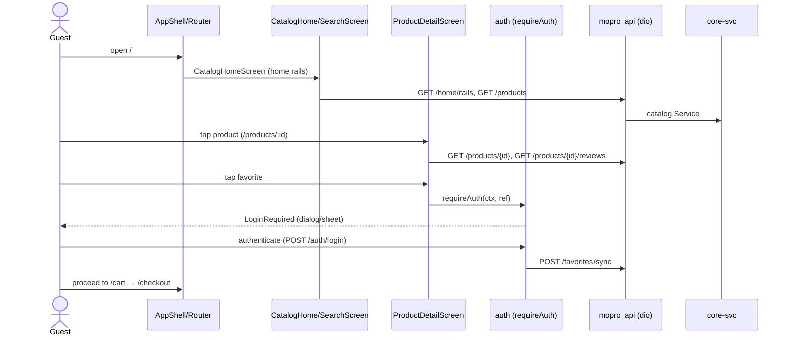
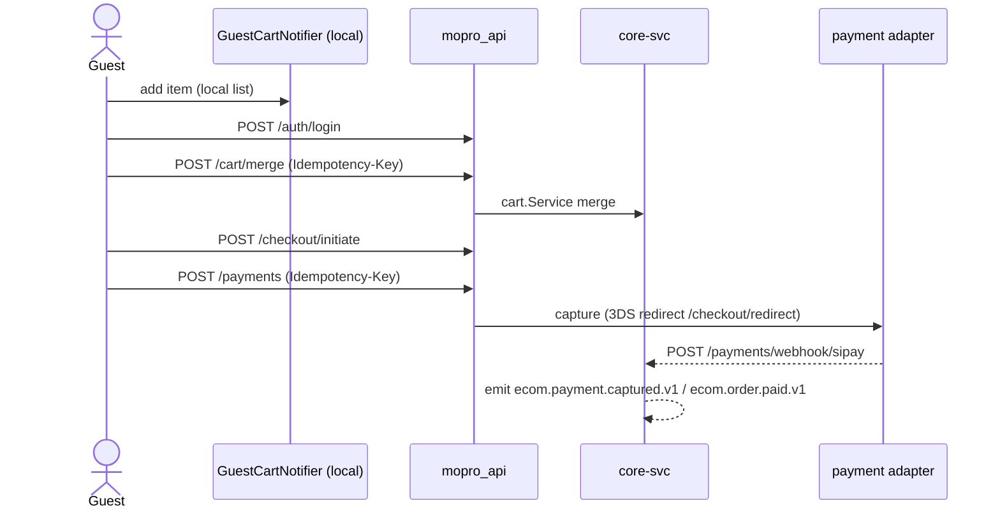
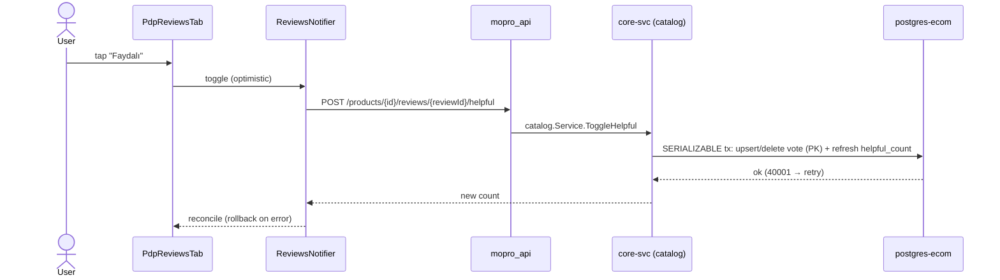
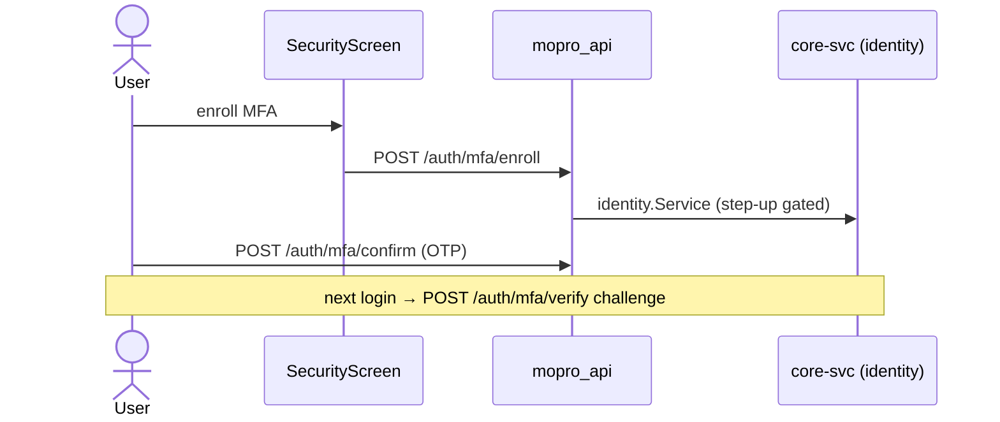
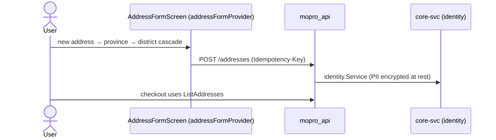
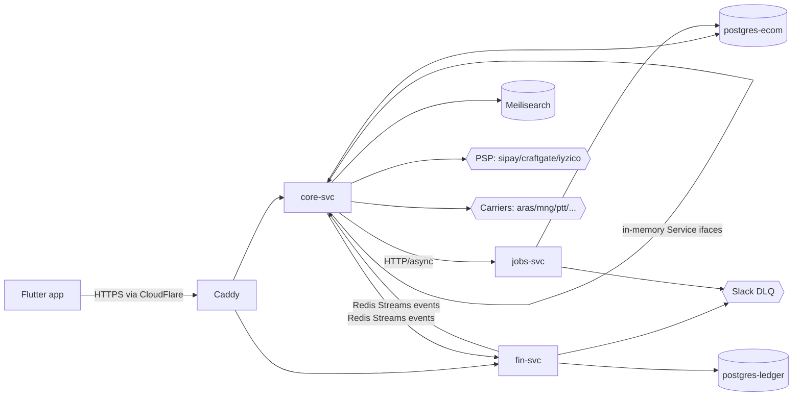
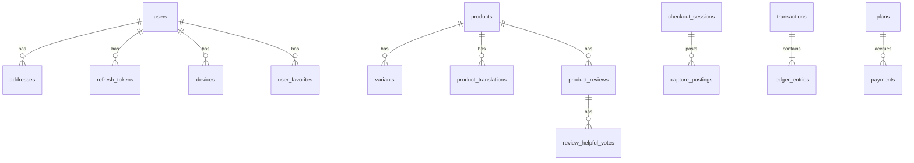
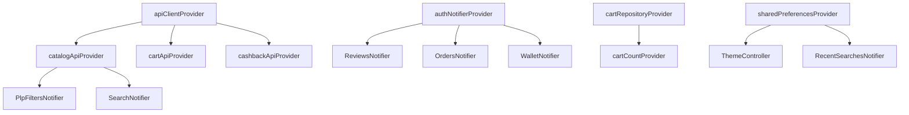

# SYSTEM_AUDIT.md — Mopro Shop full system inventory + gap analysis + roadmap

> **What this is.** A single, evidence-based snapshot of the entire Mopro Shop
> system — backend, frontend, database, infrastructure, tests, and operational
> patterns — cross-referenced so a new engineer can navigate the codebase from
> this document alone, plus a gap analysis against a generic modern e-commerce
> feature taxonomy and a prioritized 5-tranche roadmap.
>
> **Scope of this PR.** Discovery only. The only files changed are this document,
> the audit tool scripts under `tool/audit/`, the `make audit`/`audit-test`
> targets, and `CONTRIBUTING.md` promotions. No production code changed.
>
> **Generated vs. handwritten.** Blocks between `<!-- BEGIN:gen:NAME -->` and
> `<!-- END:gen:NAME -->` markers are produced by `make audit` (deterministic).
> Everything else is handwritten analysis. Re-running `make audit` on an
> unchanged tree produces no diff.

---

## Table of contents

- [§1 Snapshot (baselines)](#1-snapshot-baselines)
- [§9 Executive summary](#9-executive-summary) — *(read this first)*
- [§2 Backend inventory](#2-backend-inventory)
- [§3 Frontend inventory](#3-frontend-inventory)
- [§4 Database inventory](#4-database-inventory)
- [§5 Architecture & infrastructure](#5-architecture--infrastructure)
- [§6 Tests & CI](#6-tests--ci)
- [§7 Constitution & operational patterns](#7-constitution--operational-patterns)
- [§8 Cross-reference & flow mapping](#8-cross-reference--flow-mapping)
- [§10 Gap analysis](#10-gap-analysis-vs-a-generic-modern-e-commerce-platform)
- [§11 Prioritized roadmap](#11-prioritized-roadmap)
- [§13 Audit tooling](#13-audit-tooling)

---

## §1 Snapshot (baselines)

Captured on a fresh checkout of `main` at audit time.

| Metric | Value |
|---|---|
| `main` commit SHA | `11c3fe99` (Merge PR #20 — A11y Sweep) |
| `flutter analyze` | **No issues found** (0 errors / 0 warnings / 0 info) |
| `flutter test` | **+465 / −73** — all 73 failures are Linux-baselined goldens that fail on macOS by design; green on CI |
| `flutter test integration_test` | `integration_test/` holds 1 driver test (`wallet_flow_test.dart`); the A–U flow suite lives under `test/integration/` and runs in the main `flutter test` pass |
| `flutter build web --release` | **succeeds**; `build/web/main.dart.js` = **4,567,720 bytes** (identical to PR #20 baseline — confirms no production change) |
| `go test ./...` | **20 ok packages, 0 fail** (plus packages with no test files) |
| `docker compose ps` | 11 services in `deploy/docker-compose.yml`, all **healthy** (+2 ephemeral test-Postgres containers) |

**Container health (`docker compose -f deploy/docker-compose.yml ps`):**
`caddy`, `core-svc`, `fin-svc`, `jobs-svc`, `meilisearch`, `pgbouncer-ecom`,
`pgbouncer-ledger`, `postgres-ecom`, `postgres-ledger`, `redis` — all `Up (healthy)`;
`grafana-agent` `Up`. Test clusters `pg-ecom-test` / `pg-ledger-test` also up.

**CI gates (latest workflow runs):**
- **flutter-ci.yml** — `flutter analyze`, `build_runner (verify generated files up-to-date)`, `flutter test`, `dart analyze (mopro_api generated client)`.
- **openapi-ci.yml** — `Spectral OpenAPI lint`, `Generated files in sync`, `Go build + contract tests`, `Flutter analyze (dart-dio client)`.
- **branch-guard.yml** — refuse PR from default branch.
- **e2e.yml** — `Playwright E2E` (path-filtered, `workflow_dispatch` + PR).
- **golden-rebaseline.yml** — `Re-baseline goldens (linux)` (`workflow_dispatch`).

---

## §9 Executive summary

1. **What it is.** Mopro Shop is a mobile-first, Türkiye-launch multi-vendor
   marketplace whose signature mechanic is *perpetual cashback*: Mopro keeps the
   commission principal and pays the buyer the interest income back forever as
   monthly Mopro Coin instalments.

2. **Backend shape.** Three Go binaries (`core-svc`, `fin-svc`, `jobs-svc`) over
   a modular monolith — never microservices. `core-svc` carries identity,
   catalog, cart, order, payment, seller, search; `fin-svc` owns the
   double-entry ledger, cashback engine, and seller-payout engine; `jobs-svc`
   runs notification/support/media/sizefinder. Cross-binary communication is
   Redis Streams events with a transactional outbox; in-binary communication is
   in-memory `Service` interfaces. HTTP is Go 1.22 `net/http` ServeMux.

3. **Frontend shape.** A single Flutter app targeting web (primary, responsive)
   and mobile, using `go_router` (with `ShellRoute`/`StatefulShellRoute`),
   Riverpod for state (Notifier/AsyncNotifier/family), `easy_localization`, and a
   typed `mopro_api` dio client generated from the OpenAPI spec.

4. **Data shape.** Two physically separate Postgres 16 clusters
   (`postgres-ecom`, `postgres-ledger`) behind PgBouncer, 19 schemas, one schema
   per module, with `ref_schema` as the only cross-readable schema. The ledger is
   append-only, multi-currency-aware, and double-entry-enforced by triggers.

5. **Built well (consistently applied).** Storage-layer idempotency (PK +
   denormalized cache refreshed in the same SERIALIZABLE tx — cashback and
   reviews), the transactional outbox, integer-minor-unit money, adaptive
   web/mobile composition (`ResponsiveBuilder`, `AnchoredOverlayPanel`,
   presenter-agnostic `LoginRequired`), and an audit-before-code discipline
   (PDP extraction, router audit, this document).

6. **Stubbed / deferred (top 5).** Order returns/RMA (operation declared in spec,
   no UI/flow), an in-app notification center (route is a placeholder), review
   *submission* (only the read side ships), help/support screens (placeholder),
   and coupons/promotions beyond flash deals.

7. **Known weak spots.** Unit coverage is low on the biggest modules
   (`catalog` 7.5%, `commission` 0%) because their real logic is exercised only
   by `//go:build integration` tests that skip without a live Postgres — so a
   fast `go test ./...` understates what's actually verified. Locale parity is
   badly skewed: `de-DE` and `ar-AE` are ~15% translated. Goldens fail locally on
   macOS by design (Linux-baselined); newcomers must know not to "fix" them.

8. **How to orient.** Read `CLAUDE.md` (the constitution) first, then
   `cmd/core-svc/main.go` (how the HTTP surface is wired) and
   `mobile/lib/core/router/app_router.dart` (the whole client navigation map).
   Bring the system up with `make run-local`; gate your work with `make verify`.

---

## §2 Backend inventory

### 2.1 Services and entry points

| Binary | `main.go` | HTTP | Health | Background work | Config |
|---|---|---|---|---|---|
| `core-svc` | `cmd/core-svc/main.go` | `net/http` ServeMux on `:8080` (`main.go:567`) | `GET /healthz` (`main.go:346`) | outbox publisher goroutine; shipping poll goroutine | env (`DEFAULT_CURRENCY`, `DEFAULT_LOCALE`, `MARKET`, `OTEL_*`, `PGBOUNCER_ECOM_*`) |
| `fin-svc` | `cmd/fin-svc/main.go` | OpenAPI strict handler behind `RequireAuth` (`main.go:308–310`); `:8080` | `GET /healthz` (`main.go:303`) | consumers: orderledger, cashback, sellerpayout (×3: order, psp_onboarded, fraud_hold); crons: `cashback-monthly`, `seller-payout-daily`, `ledger-reconcile-weekly` (via `--run-once --cron`) | env + Redis addr + ledger PgBouncer |
| `jobs-svc` | `cmd/jobs-svc/main.go` | `net/http` ServeMux | `GET /healthz` (`main.go:109`) | `notification.StartReconcileDriftConsumer` (`main.go:102`); Slack drift alerts | env + ecom pool (dedup store) |

Middleware (core-svc): `middleware.RequireAuth` (`main.go:352`),
`middleware.OptionalAuth` (`main.go:353`), `httpTrace` (TraceAndLog) wrapping
each handler, plus per-write `requireIdempotencyKey` (`main.go:649`) and
`parseLocale` from `Accept-Language` (`main.go:658`).

### 2.2 Internal modules

Module list (each owns a same-named schema unless noted; `Service` interface in
`internal/<module>/api.go`):

`identity`, `catalog` (incl. reviews + favorites + home features), `cart`,
`order`, `payment` (PSP adapters), `seller`, `search` → **core-svc**;
`wallet`, `commission`, `treasury`, `cashback`, `sellerpayout`, `ledger`,
`orderledger`, `reconcile` → **fin-svc**;
`notification`, `support`, `media`, `sizefinder` → **jobs-svc**;
`eventbus`, `outbox`, `idempotency` → shared.

Per-package **unit** test coverage (own tests only; integration-gated logic not
counted — see §6.2 caveat). Highlights: `pkg/logx` 87.2%, `orderledger` 77.8%,
`pkg/crypto` 74.6%, `order` 53.3%, `reconcile` 51.9%, `sellerpayout` 41.9%,
`cashback` 41.6%, `cart` 28.6%, `wallet` 23.5%, `identity` 20.5%, `catalog`
7.5%, `payment/sipay` 5.4%, `commission` 0.0% (logic is in integration tests).

### 2.3 HTTP endpoints

`core-svc` hand-registers routes as Go 1.22 method patterns; `fin-svc` is wired
from the OpenAPI-generated strict handler (its surface == the spec). The table
below is generated by `tool/audit/list_endpoints.sh` and flags, per
hand-registered route, whether the same method+path is declared in
`api/openapi.yaml`.

<!-- BEGIN:gen:endpoints -->
### A. Code-registered routes (core-svc & friends)

| Method | Path | Service | File:Line | In OpenAPI |
|---|---|---|---|---|
| POST | `/auth/register` | core-svc | `cmd/core-svc/auth_handlers.go:52` | no |
| POST | `/auth/login` | core-svc | `cmd/core-svc/auth_handlers.go:55` | no |
| POST | `/auth/verify-email` | core-svc | `cmd/core-svc/auth_handlers.go:59` | no |
| POST | `/auth/resend-verification` | core-svc | `cmd/core-svc/auth_handlers.go:62` | no |
| POST | `/auth/forgot-password` | core-svc | `cmd/core-svc/auth_handlers.go:65` | no |
| POST | `/auth/reset-password` | core-svc | `cmd/core-svc/auth_handlers.go:68` | no |
| POST | `/auth/mfa/verify` | core-svc | `cmd/core-svc/auth_handlers.go:71` | no |
| POST | `/auth/otp/request` | core-svc | `cmd/core-svc/auth_handlers.go:75` | yes |
| POST | `/auth/otp/verify` | core-svc | `cmd/core-svc/auth_handlers.go:78` | yes |
| POST | `/auth/token/refresh` | core-svc | `cmd/core-svc/auth_handlers.go:81` | yes |
| POST | `/auth/logout` | core-svc | `cmd/core-svc/auth_handlers.go:86` | yes |
| POST | `/auth/mfa/enroll` | core-svc | `cmd/core-svc/auth_handlers.go:89` | no |
| POST | `/auth/mfa/confirm` | core-svc | `cmd/core-svc/auth_handlers.go:92` | no |
| DELETE | `/auth/mfa` | core-svc | `cmd/core-svc/auth_handlers.go:95` | no |
| GET | `/me` | core-svc | `cmd/core-svc/auth_handlers.go:98` | yes |
| PATCH | `/me` | core-svc | `cmd/core-svc/auth_handlers.go:101` | yes |
| POST | `/me/password` | core-svc | `cmd/core-svc/auth_handlers.go:104` | yes |
| DELETE | `/me` | core-svc | `cmd/core-svc/auth_handlers.go:107` | yes |
| POST | `/auth/step-up/request` | core-svc | `cmd/core-svc/auth_handlers.go:110` | no |
| POST | `/auth/step-up/verify` | core-svc | `cmd/core-svc/auth_handlers.go:113` | no |
| POST | `/me/devices` | core-svc | `cmd/core-svc/auth_handlers.go:116` | yes |
| GET | `/healthz` | core-svc | `cmd/core-svc/main.go:368` | yes |
| GET | `/__version` | core-svc | `cmd/core-svc/main.go:371` | no |
| GET | `/sitemap.xml` | core-svc | `cmd/core-svc/main.go:374` | no |
| GET | `/robots.txt` | core-svc | `cmd/core-svc/main.go:381` | no |
| GET | `/dev/email-code` | core-svc | `cmd/core-svc/main.go:413` | no |
| POST | `/products` | core-svc | `cmd/core-svc/main.go:429` | yes |
| GET | `/products` | core-svc | `cmd/core-svc/main.go:432` | yes |
| GET | `/products/{id}` | core-svc | `cmd/core-svc/main.go:435` | yes |
| POST | `/products/{id}/variants` | core-svc | `cmd/core-svc/main.go:438` | no |
| PUT | `/products/{id}/translations/{locale}` | core-svc | `cmd/core-svc/main.go:441` | no |
| GET | `/categories` | core-svc | `cmd/core-svc/main.go:444` | yes |
| GET | `/categories/{id}/commission` | core-svc | `cmd/core-svc/main.go:447` | yes |
| GET | `/search` | core-svc | `cmd/core-svc/main.go:450` | yes |
| GET | `/banners` | core-svc | `cmd/core-svc/main.go:453` | yes |
| GET | `/recommendations` | core-svc | `cmd/core-svc/main.go:456` | yes |
| GET | `/home/banners` | core-svc | `cmd/core-svc/main.go:461` | no |
| GET | `/home/rails` | core-svc | `cmd/core-svc/main.go:464` | no |
| GET | `/home/stories` | core-svc | `cmd/core-svc/main.go:467` | no |
| GET | `/home/flash-deals` | core-svc | `cmd/core-svc/main.go:470` | no |
| POST | `/products/batch` | core-svc | `cmd/core-svc/main.go:473` | no |
| GET | `/products/{id}/reviews` | core-svc | `cmd/core-svc/main.go:477` | no |
| POST | `/products/{id}/reviews/{reviewId}/helpful` | core-svc | `cmd/core-svc/main.go:481` | no |
| GET | `/search/trending` | core-svc | `cmd/core-svc/main.go:484` | yes |
| POST | `/favorites/sync` | core-svc | `cmd/core-svc/main.go:487` | no |
| POST | `/cart/merge` | core-svc | `cmd/core-svc/main.go:491` | no |
| GET | `/addresses` | core-svc | `cmd/core-svc/main.go:517` | yes |
| POST | `/addresses` | core-svc | `cmd/core-svc/main.go:520` | yes |
| GET | `/addresses/{id}` | core-svc | `cmd/core-svc/main.go:523` | no |
| PUT | `/addresses/{id}` | core-svc | `cmd/core-svc/main.go:526` | yes |
| DELETE | `/addresses/{id}` | core-svc | `cmd/core-svc/main.go:529` | yes |
| POST | `/cart/items` | core-svc | `cmd/core-svc/main.go:534` | yes |
| DELETE | `/cart/items/{variant_id}` | core-svc | `cmd/core-svc/main.go:537` | yes |
| GET | `/cart` | core-svc | `cmd/core-svc/main.go:540` | yes |
| POST | `/cart/reserve` | core-svc | `cmd/core-svc/main.go:543` | yes |
| POST | `/cart/release` | core-svc | `cmd/core-svc/main.go:546` | yes |
| POST | `/checkout/initiate` | core-svc | `cmd/core-svc/main.go:551` | no |
| POST | `/orders` | core-svc | `cmd/core-svc/main.go:561` | yes |
| GET | `/orders/{id}` | core-svc | `cmd/core-svc/main.go:564` | yes |
| GET | `/orders` | core-svc | `cmd/core-svc/main.go:567` | yes |
| POST | `/orders/{id}/status` | core-svc | `cmd/core-svc/main.go:570` | no |
| POST | `/orders/{id}/deliver` | core-svc | `cmd/core-svc/main.go:573` | no |
| POST | `/orders/{id}/cancel` | core-svc | `cmd/core-svc/main.go:576` | yes |
| POST | `/orders/{id}/refund` | core-svc | `cmd/core-svc/main.go:579` | yes |
| POST | `/orders/{id}/returns` | core-svc | `cmd/core-svc/main.go:582` | yes |
| GET | `/returns` | core-svc | `cmd/core-svc/main.go:585` | no |
| GET | `/returns/{id}` | core-svc | `cmd/core-svc/main.go:588` | no |
| GET | `/notifications` | core-svc | `cmd/core-svc/main.go:592` | no |
| GET | `/notifications/unread-count` | core-svc | `cmd/core-svc/main.go:595` | no |
| POST | `/notifications/{id}/read` | core-svc | `cmd/core-svc/main.go:598` | no |
| POST | `/notifications/read-all` | core-svc | `cmd/core-svc/main.go:601` | no |
| GET | `/notifications/preferences` | core-svc | `cmd/core-svc/main.go:604` | no |
| PUT | `/notifications/preferences` | core-svc | `cmd/core-svc/main.go:607` | no |
| POST | `/push-tokens` | core-svc | `cmd/core-svc/main.go:610` | no |
| DELETE | `/push-tokens` | core-svc | `cmd/core-svc/main.go:613` | no |
| GET | `/help/categories` | core-svc | `cmd/core-svc/main.go:617` | no |
| GET | `/help/categories/{slug}/articles` | core-svc | `cmd/core-svc/main.go:620` | no |
| GET | `/help/articles/{slug}` | core-svc | `cmd/core-svc/main.go:623` | no |
| GET | `/help/search` | core-svc | `cmd/core-svc/main.go:626` | no |
| POST | `/support/tickets` | core-svc | `cmd/core-svc/main.go:630` | no |
| GET | `/support/tickets` | core-svc | `cmd/core-svc/main.go:633` | no |
| GET | `/support/tickets/{id}` | core-svc | `cmd/core-svc/main.go:636` | no |
| POST | `/products/{productId}/reviews` | core-svc | `cmd/core-svc/main.go:640` | no |
| PUT | `/products/{productId}/reviews/{reviewId}` | core-svc | `cmd/core-svc/main.go:643` | no |
| DELETE | `/products/{productId}/reviews/{reviewId}` | core-svc | `cmd/core-svc/main.go:646` | no |
| GET | `/me/reviews` | core-svc | `cmd/core-svc/main.go:649` | no |
| GET | `/products/{id}/review-eligibility` | core-svc | `cmd/core-svc/main.go:652` | no |
| POST | `/products/{productId}/questions` | core-svc | `cmd/core-svc/main.go:656` | no |
| GET | `/products/{productId}/questions` | core-svc | `cmd/core-svc/main.go:659` | no |
| GET | `/products/{productId}/questions/{questionId}` | core-svc | `cmd/core-svc/main.go:662` | no |
| POST | `/products/{productId}/questions/{questionId}/answers` | core-svc | `cmd/core-svc/main.go:665` | no |
| GET | `/me/questions` | core-svc | `cmd/core-svc/main.go:668` | no |
| GET | `/sellers/{slug}` | core-svc | `cmd/core-svc/main.go:673` | no |
| GET | `/sellers/{slug}/products` | core-svc | `cmd/core-svc/main.go:676` | no |
| GET | `/sellers/{slug}/reviews` | core-svc | `cmd/core-svc/main.go:679` | no |
| GET | `/seller/returns` | core-svc | `cmd/core-svc/main.go:682` | no |
| POST | `/seller/returns/{id}/approve` | core-svc | `cmd/core-svc/main.go:685` | no |
| POST | `/seller/returns/{id}/reject` | core-svc | `cmd/core-svc/main.go:688` | no |
| GET | `/seller/questions` | core-svc | `cmd/core-svc/main.go:691` | no |
| POST | `/analytics/events` | core-svc | `cmd/core-svc/main.go:697` | no |
| POST | `/analytics/sessions/identify` | core-svc | `cmd/core-svc/main.go:700` | no |
| GET | `/me/consent` | core-svc | `cmd/core-svc/main.go:703` | no |
| PUT | `/me/consent` | core-svc | `cmd/core-svc/main.go:706` | no |
| DELETE | `/me/analytics-data` | core-svc | `cmd/core-svc/main.go:709` | no |
| GET | `/me/recently-viewed` | core-svc | `cmd/core-svc/main.go:712` | no |
| GET | `/seller/orders/{id}/breakdown` | core-svc | `cmd/core-svc/main.go:718` | yes |
| POST | `/payments` | core-svc | `cmd/core-svc/main.go:723` | no |
| GET | `/payments/{provider_ref}/status` | core-svc | `cmd/core-svc/main.go:726` | no |
| GET | `/payments/{invoiceID}/intent-status` | core-svc | `cmd/core-svc/main.go:730` | no |
| POST | `/payments/webhook/sipay` | core-svc | `cmd/core-svc/main.go:735` | no |
| POST | `/shipping/webhook/surat` | core-svc | `cmd/core-svc/main.go:740` | no |
| POST | `/shipping/webhook/mng` | core-svc | `cmd/core-svc/main.go:743` | no |
| POST | `/shipping/webhook/hepsijet` | core-svc | `cmd/core-svc/main.go:746` | no |

### B. OpenAPI operation catalogue (`api/openapi.yaml`)

| Method+Path | operationId |
|---|---|
| `DELETE /addresses/{id}` | DeleteAddress |
| `DELETE /cart/items/{variant_id}` | RemoveCartItem |
| `DELETE /me` | DeleteMe |
| `DELETE /me/devices/{id}` | UnregisterDevice |
| `GET /addresses` | ListAddresses |
| `GET /banners` | ListBanners |
| `GET /cart` | GetCart |
| `GET /cashback/plans` | ListCashbackPlans |
| `GET /cashback/plans/{id}` | GetCashbackPlan |
| `GET /cashback/plans/{id}/payments` | ListCashbackPayments |
| `GET /categories` | ListCategories |
| `GET /categories/{id}/commission` | GetCategoryCommission |
| `GET /healthz` | Healthz |
| `GET /me` | GetMe |
| `GET /orders` | ListOrders |
| `GET /orders/{id}` | GetOrder |
| `GET /orders/{id}/returns` | ListReturns |
| `GET /products` | ListProducts |
| `GET /products/{id}` | GetProduct |
| `GET /recommendations` | ListRecommendations |
| `GET /search` | Search |
| `GET /search/suggest` | SearchSuggest |
| `GET /search/trending` | SearchTrending |
| `GET /seller/orders/{id}/breakdown` | GetSellerOrderBreakdown |
| `GET /wallet/balance` | GetWalletBalance |
| `GET /wallet/transactions` | ListWalletTransactions |
| `PATCH /me` | UpdateMe |
| `POST /addresses` | CreateAddress |
| `POST /auth/logout` | Logout |
| `POST /auth/otp/request` | RequestOtp |
| `POST /auth/otp/verify` | VerifyOtp |
| `POST /auth/step-up` | StepUp |
| `POST /auth/token/refresh` | RefreshToken |
| `POST /cart/items` | AddCartItem |
| `POST /cart/release` | ReleaseCart |
| `POST /cart/reserve` | ReserveCart |
| `POST /me/devices` | RegisterDevice |
| `POST /me/password` | ChangePassword |
| `POST /orders` | CreateOrder |
| `POST /orders/checkout` | Checkout |
| `POST /orders/{id}/cancel` | CancelOrder |
| `POST /orders/{id}/refund` | RefundOrder |
| `POST /orders/{id}/returns` | CreateReturn |
| `POST /products` | CreateProduct |
| `PUT /addresses/{id}` | UpdateAddress |

_Totals: 113 code-registered routes; 45 OpenAPI operations._
<!-- END:gen:endpoints -->

### 2.4 OpenAPI and code generation

- Spec: `api/openapi.yaml` (single spec; core + fin subsets). Lint config
  `api/.spectral.yaml`; codegen configs `api/oapi-codegen-{core,fin,models}.yaml`.
- Generated: Go server stubs (`internal/api/gen/{core,fin,types}`), the Dart
  `mopro_api` dio client (`make api-gen-dart`). No TypeScript client.
- Regeneration: `make api-gen` (→ `api-gen-models`, `api-gen-core`,
  `api-gen-fin`, `api-gen-dart`). Drift detection: `make api-check-sync` +
  the `openapi-ci` "Generated files in sync" gate + the `flutter-ci` build_runner gate.
- **Drift note:** several `core-svc` routes are hand-written and *not* in the
  spec (see the "In OpenAPI = no" rows in §2.3) — reviews, home rails, variants,
  translations, dev helpers. This is deliberate but means the spec is not the
  complete HTTP contract for core-svc.

### 2.5 Async messaging / events

- **Broker:** Redis 7 Streams. **Outbox:** every financial event is written to
  an `outbox` table in the same DB tx as the ledger write; an outbox-publisher
  worker XADDs to Redis (`internal/outbox`, `internal/eventbus`).
- **Topics** (`<domain>.<entity>.<action>.v<n>`): `ecom.order.delivered.v1`
  (triggers BOTH cashback plan creation and seller-payout scheduling),
  `ecom.order.paid.v1`, `ecom.payment.{captured,failed,refunded,unknown}.v1`,
  `ecom.user.{created,updated,soft_deleted}.v1`,
  `ecom.device.{registered,revoked}.v1`,
  `ecom.seller.{psp_onboarded,fraud_hold_set}.v1`, `fin.ledger.posted.v1`,
  `fin.reconciliation.drift_critical.v1`.
- **DLQ / replay:** dead-letter handling with Slack alerting via
  `eventbus.NewSlackPosterAdapter` (CLAUDE.md §5 Phase 3.2 exception); reconcile
  drift escalates to `fin.reconciliation.drift_critical.v1` → jobs-svc → Slack.

### 2.6 External integrations

| Concern | Implementation | Notes |
|---|---|---|
| Payment | `internal/payment/{sipay,craftgate,iyzico}` adapters | `PSP_PROVIDER` env selects active; webhook `POST /payments/webhook/sipay` |
| Shipping | `internal/shipping/{aras,hepsijet,mng,ptt,yurtici,surat}` | webhooks `POST /shipping/webhook/{hepsijet,mng,surat}`; poll goroutine |
| Search | Meilisearch v1.6 (`meilisearch` container) | `internal/search` |
| Email / SMS | transactional via identity (email verification, OTP) | `GET /dev/email-code` dev helper |
| Push | device token registration `POST /me/devices` | token storage present; **sending not wired** |
| Object storage / CDN | media via `internal/media` + `pkg/mediaurl`; CloudFlare CDN/WAF | |
| Observability | Grafana Agent → Grafana Cloud; OTel (`pkg/otelx`, `pkg/tracing`); metrics (`pkg/metrics`) | Slack + PagerDuty alert sinks (`pkg/slack`, `pkg/pagerduty`) |

### 2.7 Authentication and authorization

- JWT bearer (`middleware.RequireAuth`); refresh tokens
  (`identity_schema.refresh_tokens`, `POST /auth/token/refresh`).
- MFA/OTP: enroll/confirm/verify (`POST /auth/mfa/*`), OTP request/verify, and
  **step-up** auth (`POST /auth/step-up/*`) for sensitive ops per CLAUDE.md §6.
- Guest mode: server-side `OptionalAuth` personalizes public reads (e.g. reviews
  `votedByCurrentUser`); client-side `requireAuth(ctx, ref, …)` soft-gates
  actions with an adaptive `LoginRequired` presenter and resume-once contract.
- Account lifecycle: `DELETE /me` (soft delete → `ecom.user.soft_deleted.v1`).

### 2.8 Observability

- **Logging:** `pkg/logx` (slog wrapper, market-aware), structured JSON.
- **Tracing:** OTel init in `pkg/otelx` / `pkg/tracing`; `httpTrace` middleware
  stamps trace/span IDs (propagated into events).
- **Metrics:** `pkg/metrics` (Prometheus-style); scraped by Grafana Agent.
- **Error tracking:** Slack (`pkg/slack`) + PagerDuty (`pkg/pagerduty`) for DLQ
  and ledger-drift alerts. No Sentry.

---

## §3 Frontend inventory

### 3.1 / 3.2 Routes & screens

Generated by `tool/audit/list_routes.dart` (path, source line, screen-widget
guess, shell membership). Tab titles resolve through `moproPageTitle` (PR #20).

<!-- BEGIN:gen:routes -->
| Path | Source | Screen (guess) | Shell |
|---|---|---|---|
| `/splash` | `app_router.dart:271` | SplashScreen | — |
| `/auth/login` | `app_router.dart:276` | SignInScreen | — |
| `/auth/register` | `app_router.dart:280` | SignUpScreen | — |
| `/auth/verify-email` | `app_router.dart:284` | EmailVerifyScreen | — |
| `/auth/forgot-password` | `app_router.dart:290` | ForgotPasswordScreen | — |
| `/auth/mfa` | `app_router.dart:294` | MFAChallengeScreen | — |
| `/auth/profile` | `app_router.dart:304` | ProfileCompletionScreen | — |
| `/search` | `app_router.dart:308` | SearchScreen | — |
| `/products/:id` | `app_router.dart:317` | (builder) | — |
| `/sellers/:slug` | `app_router.dart:336` | (builder) | — |
| `/seller/dashboard` | `app_router.dart:351` | SellerDashboardScreen | — |
| `/seller/returns` | `app_router.dart:357` | SellerReturnsInboxScreen | — |
| `/seller/returns/:id` | `app_router.dart:367` | (builder) | — |
| `/seller/questions` | `app_router.dart:390` | SellerQuestionsInboxScreen | — |
| `/seller/questions/:id` | `app_router.dart:401` | (builder) | — |
| `/products/:id/questions` | `app_router.dart:425` | (builder) | — |
| `:qid` | `app_router.dart:443` | (builder) | — |
| `/orders/:id/return` | `app_router.dart:465` | (builder) | — |
| `/categories/:id` | `app_router.dart:486` | (builder) | — |
| `/checkout` | `app_router.dart:503` | CheckoutAddressScreen | — |
| `payment` | `app_router.dart:508` | CheckoutPaymentScreen | — |
| `review` | `app_router.dart:512` | CheckoutReviewScreen | — |
| `redirect` | `app_router.dart:516` | CheckoutRedirectScreen | — |
| `result` | `app_router.dart:523` | CheckoutResultScreen | — |
| `/account/profile` | `app_router.dart:547` | AccountProfileScreen | ShellRoute |
| `/account/security` | `app_router.dart:551` | SecurityScreen | ShellRoute |
| `/account/cards` | `app_router.dart:555` | CardsScreen | ShellRoute |
| `/account/reviews` | `app_router.dart:559` | MyReviewsScreen | ShellRoute |
| `/account/questions` | `app_router.dart:563` | MyQuestionsScreen | ShellRoute |
| `/account/privacy` | `app_router.dart:567` | PrivacySettingsScreen | ShellRoute |
| `/account/browsing-history` | `app_router.dart:571` | BrowsingHistoryScreen | ShellRoute |
| `/account/notifications` | `app_router.dart:575` | NotificationsScreen | ShellRoute |
| `preferences` | `app_router.dart:579` | NotificationPreferencesScreen | ShellRoute |
| `/help` | `app_router.dart:585` | HelpIndexScreen | ShellRoute |
| `category/:slug` | `app_router.dart:589` | HelpCategoryScreen | ShellRoute |
| `article/:slug` | `app_router.dart:594` | HelpArticleScreen | ShellRoute |
| `search` | `app_router.dart:599` | HelpSearchScreen | ShellRoute |
| `contact` | `app_router.dart:605` | ContactFormScreen | ShellRoute |
| `/orders` | `app_router.dart:617` | OrderHistoryScreen | ShellRoute |
| `:id` | `app_router.dart:621` | (builder) | ShellRoute |
| `/returns` | `app_router.dart:637` | ReturnsListScreen | ShellRoute |
| `:id` | `app_router.dart:641` | (builder) | ShellRoute |
| `/wallet` | `app_router.dart:657` | WalletScreen | ShellRoute |
| `plans/:id` | `app_router.dart:661` | (builder) | ShellRoute |
| `/profile/addresses` | `app_router.dart:677` | AddressListScreen | ShellRoute |
| `new` | `app_router.dart:681` | AddressFormScreen | ShellRoute |
| `:id/edit` | `app_router.dart:685` | AddressFormScreen | ShellRoute |
| `/` | `app_router.dart:705` | CatalogHomeScreen | StatefulShellRoute |
| `/categories` | `app_router.dart:715` | CategoryScreen | StatefulShellRoute |
| `/favorites` | `app_router.dart:725` | FavoritesScreen | StatefulShellRoute |
| `/cart` | `app_router.dart:735` | CartScreen | StatefulShellRoute |
| `/account` | `app_router.dart:745` | AccountScreen | StatefulShellRoute |

_Total: 52 route declarations._
<!-- END:gen:routes -->

Notable: `/account/notifications` and `/help` both resolve to
`AccountPlaceholderScreen` — the two known placeholders from PR #19. Auth gating
is a mix of public routes, soft-gates via `requireAuth`, and the `splash`/`auth`
redirect on boot.

### 3.3 Design system surface

- **Tokens:** `mobile/lib/design/tokens.dart` (`MoproTokens`),
  `theme.dart` (`buildLightTheme`), `theme_controller.dart` (`ThemeController`,
  force-light default per Session 4e), `a11y_contrast.dart` (PR #20 WCAG helper).
- **Responsive kit** (`mobile/lib/design/responsive/`): `ResponsiveBuilder`
  (6 call sites), `AnchoredOverlayPanel` (4 consumers: `account_hover_menu`,
  `web_search_pill`, `mega_menu_panel`, `mega_menu_bar`), `breakpoints`,
  `adaptive_value`, `hover_region`, `centered_content_column`,
  `responsive_image_url`, `responsive_network_image`.
- **Named widgets:** `WebHeader`, `MegaMenuBar`, `FilterPanel`,
  `OrderSummaryCard`, `AccountLeftRail`, `ProductCard`, `LoginRequired`,
  `SkipToContentLink`, `ResponsiveNetworkImage`.

### 3.4 Providers

Generated by `tool/audit/list_providers.dart` (declarations + Notifier
subclasses). Notifier-shape taxonomy is documented in `CONTRIBUTING.md`.

<!-- BEGIN:gen:providers -->
### Provider declarations

| Provider | Kind | Source |
|---|---|---|
| `_logoutFnProvider` | `Provider` | `mobile/lib/core/di/providers.dart:90` |
| `addressApiProvider` | `Provider` | `mobile/lib/api/client.dart:48` |
| `addressFormProvider` | `NotifierProviderFamily` | `mobile/lib/features/address/providers/address_form_controller.dart:84` |
| `analyticsServiceProvider` | `Provider` | `mobile/lib/features/analytics/analytics_service.dart:164` |
| `apiBaseUrlProvider` | `Provider` | `mobile/lib/core/di/providers.dart:13` |
| `apiClientProvider` | `Provider` | `mobile/lib/api/client.dart:7` |
| `authApiExtProvider` | `Provider` | `mobile/lib/core/di/providers.dart:82` |
| `authApiProvider` | `Provider` | `mobile/lib/api/client.dart:12` |
| `authApiProvider` | `Provider` | `mobile/lib/core/di/providers.dart:78` |
| `authInterceptorProvider` | `Provider` | `mobile/lib/core/di/providers.dart:40` |
| `cartApiProvider` | `Provider` | `mobile/lib/api/client.dart:20` |
| `cartCashbackCacheProvider` | `Provider` | `mobile/lib/features/cart/application/cart_cashback_cache.dart:61` |
| `cartCountProvider` | `Provider` | `mobile/lib/features/cart/application/cart_count_provider.dart:5` |
| `cartRepositoryProvider` | `Provider` | `mobile/lib/features/cart/application/cart_provider.dart:32` |
| `cashbackApiProvider` | `Provider` | `mobile/lib/api/client.dart:28` |
| `catalogApiProvider` | `Provider` | `mobile/lib/api/client.dart:16` |
| `categoryTreeProvider` | `Provider` | `mobile/lib/features/catalog/providers/category_tree_provider.dart:29` |
| `checkoutRepositoryProvider` | `Provider` | `mobile/lib/features/checkout/application/checkout_controller.dart:13` |
| `currentSellerBindingProvider` | `Provider` | `mobile/lib/features/seller/user_is_seller_provider.dart:16` |
| `currentUserProvider` | `FutureProvider` | `mobile/lib/features/account/current_user_provider.dart:55` |
| `dioProvider` | `Provider` | `mobile/lib/core/di/providers.dart:57` |
| `guestCartCountProvider` | `Provider` | `mobile/lib/features/cart/application/guest_cart_provider.dart:115` |
| `helpCategoriesProvider` | `FutureProvider` | `mobile/lib/features/help/application/help_providers.dart:6` |
| `helpRepositoryProvider` | `Provider` | `mobile/lib/features/help/data/help_repository.dart:63` |
| `homeBannersProvider` | `FutureProvider` | `mobile/lib/features/catalog/providers/home_provider.dart:37` |
| `homeMoodStoriesProvider` | `FutureProvider` | `mobile/lib/features/catalog/providers/home_provider.dart:87` |
| `isFavoriteProvider` | `Provider` | `mobile/lib/features/favorites/favorites_provider.dart:38` |
| `localeStateProvider` | `StateProvider` | `mobile/lib/core/di/providers.dart:36` |
| `meApiProvider` | `Provider` | `mobile/lib/api/client.dart:44` |
| `meApiProvider` | `Provider` | `mobile/lib/core/di/providers.dart:86` |
| `notificationRepositoryProvider` | `Provider` | `mobile/lib/features/notifications/data/notification_repository.dart:90` |
| `notificationsProvider` | `NotifierProviderFamily` | `mobile/lib/features/notifications/application/notifications_provider.dart:88` |
| `orderRepositoryProvider` | `Provider` | `mobile/lib/features/order/application/orders_provider.dart:13` |
| `ordersApiProvider` | `Provider` | `mobile/lib/api/client.dart:32` |
| `pendingSnackbarProvider` | `StateProvider` | `mobile/lib/core/router/app_router.dart:208` |
| `planDetailProvider` | `AutoDisposeNotifierProviderFamily` | `mobile/lib/features/wallet/providers/plan_detail_provider.dart:51` |
| `productsByCategoryProvider` | `NotifierProviderFamily` | `mobile/lib/features/catalog/providers/products_by_category_provider.dart:40` |
| `productsRailProvider` | `FutureProvider` | `mobile/lib/features/catalog/providers/products_rail_provider.dart:5` |
| `qaRepositoryProvider` | `Provider` | `mobile/lib/features/catalog/pdp/qa/qa_provider.dart:173` |
| `questionThreadProvider` | `FutureProvider` | `mobile/lib/features/catalog/pdp/qa/qa_provider.dart:179` |
| `returnDetailProvider` | `NotifierProviderFamily` | `mobile/lib/features/order/application/returns_provider.dart:43` |
| `reviewWriteRepositoryProvider` | `Provider` | `mobile/lib/features/catalog/pdp/reviews/review_write_provider.dart:176` |
| `routerProvider` | `Provider` | `mobile/lib/core/router/app_router.dart:237` |
| `searchApiProvider` | `Provider` | `mobile/lib/api/client.dart:36` |
| `secureStorageProvider` | `Provider` | `mobile/lib/core/di/providers.dart:26` |
| `sellerApiProvider` | `Provider` | `mobile/lib/api/client.dart:40` |
| `sellerProductsProvider` | `NotifierProvider` | `mobile/lib/features/seller/providers/seller_storefront_provider.dart:99` |
| `sellerReviewsProvider` | `NotifierProvider` | `mobile/lib/features/seller/providers/seller_storefront_provider.dart:155` |
| `sessionRevokedProvider` | `StateProvider` | `mobile/lib/core/di/providers.dart:76` |
| `shareServiceProvider` | `Provider` | `mobile/lib/features/growth/share_service.dart:58` |
| `sharedPreferencesProvider` | `Provider` | `mobile/lib/design/theme_controller.dart:51` |
| `tokenStorageProvider` | `Provider` | `mobile/lib/core/di/providers.dart:32` |
| `trProvincesProvider` | `FutureProvider` | `mobile/lib/features/address/providers/tr_provinces_provider.dart:13` |
| `trendingSearchesProvider` | `FutureProvider` | `mobile/lib/features/catalog/providers/home_provider.dart:109` |
| `userIsSellerProvider` | `Provider` | `mobile/lib/features/seller/user_is_seller_provider.dart:9` |
| `walletApiProvider` | `Provider` | `mobile/lib/api/client.dart:24` |
| `webBaseUrlProvider` | `Provider` | `mobile/lib/core/di/providers.dart:24` |

### Notifier subclasses

| Class | Base | Source |
|---|---|---|
| `AddressesNotifier` | `Notifier<AddressesState>` | `mobile/lib/features/address/providers/addresses_provider.dart:22` |
| `AuthNotifier` | `AsyncNotifier<AuthState>` | `mobile/lib/core/auth/auth_notifier.dart:10` |
| `AuthProfileNotifier` | `AutoDisposeNotifier<ProfileState>` | `mobile/lib/features/auth/auth_profile_notifier.dart:52` |
| `CartNotifier` | `Notifier<CartState>` | `mobile/lib/features/cart/application/cart_provider.dart:64` |
| `CashbackPlansNotifier` | `Notifier<CashbackPlansState>` | `mobile/lib/features/wallet/providers/cashback_plans_provider.dart:54` |
| `CategoriesNotifier` | `Notifier<CategoriesState>` | `mobile/lib/features/catalog/providers/categories_provider.dart:23` |
| `CheckoutController` | `Notifier<CheckoutState>` | `mobile/lib/features/checkout/application/checkout_controller.dart:74` |
| `FavoritesNotifier` | `StateNotifier<Set<int>>` | `mobile/lib/features/favorites/favorites_provider.dart:7` |
| `ForgotPasswordNotifier` | `Notifier<ForgotPasswordState>` | `mobile/lib/features/auth/forgot_password_notifier.dart:23` |
| `GuestCartNotifier` | `StateNotifier<List<GuestCartItem>>` | `mobile/lib/features/cart/application/guest_cart_provider.dart:34` |
| `MFANotifier` | `Notifier<MFAState>` | `mobile/lib/features/auth/auth_mfa_notifier.dart:30` |
| `MyQuestionsNotifier` | `Notifier<MyQuestionsState>` | `mobile/lib/features/catalog/pdp/qa/qa_provider.dart:344` |
| `MyReviewsNotifier` | `Notifier<MyReviewsState>` | `mobile/lib/features/catalog/pdp/reviews/review_write_provider.dart:232` |
| `OrderDetailNotifier` | `FamilyNotifier<AsyncValue<OrderDto>, int>` | `mobile/lib/features/order/application/order_detail_provider.dart:12` |
| `OrdersNotifier` | `Notifier<OrdersState>` | `mobile/lib/features/order/application/orders_provider.dart:60` |
| `PlpFiltersNotifier` | `FamilyNotifier<PlpFilters, String>` | `mobile/lib/features/catalog/plp/plp_filters_provider.dart:12` |
| `PreferencesNotifier` | `Notifier<PreferencesState>` | `mobile/lib/features/notifications/application/notification_preferences_provider.dart:55` |
| `QuestionsNotifier` | `FamilyNotifier<QuestionsState, int>` | `mobile/lib/features/catalog/pdp/qa/qa_provider.dart:230` |
| `RecentSearchesNotifier` | `StateNotifier<List<String>>` | `mobile/lib/features/catalog/providers/recent_searches_provider.dart:10` |
| `RecentlyViewedNotifier` | `Notifier<AsyncValue<List<ProductSummary>>>` | `mobile/lib/features/home/recently_viewed_provider.dart:17` |
| `ReturnFlowNotifier` | `FamilyNotifier<ReturnFlowState, int>` | `mobile/lib/features/order/application/return_flow_provider.dart:75` |
| `ReturnsNotifier` | `Notifier<AsyncValue<List<ReturnListItemDto>>>` | `mobile/lib/features/order/application/returns_provider.dart:14` |
| `ReviewsNotifier` | `FamilyNotifier<ReviewsState, int>` | `mobile/lib/features/catalog/pdp/reviews/reviews_provider.dart:141` |
| `SearchNotifier` | `Notifier<SearchState>` | `mobile/lib/features/catalog/providers/search_provider.dart:51` |
| `SellerReturnsNotifier` | `FamilyNotifier<SellerReturnsState, String>` | `mobile/lib/features/seller/providers/seller_returns_provider.dart:40` |
| `SignInNotifier` | `Notifier<SignInState>` | `mobile/lib/features/auth/auth_signin_notifier.dart:40` |
| `SignUpNotifier` | `Notifier<SignUpState>` | `mobile/lib/features/auth/auth_signup_notifier.dart:33` |
| `ThemeController` | `StateNotifier<ThemeMode>` | `mobile/lib/design/theme_controller.dart:14` |
| `UnreadCountNotifier` | `Notifier<int>` | `mobile/lib/features/notifications/application/notifications_provider.dart:20` |
| `UserConsentNotifier` | `Notifier<UserConsent>` | `mobile/lib/features/analytics/user_consent_provider.dart:51` |
| `WalletNotifier` | `Notifier<WalletState>` | `mobile/lib/features/wallet/providers/wallet_provider.dart:56` |
| `_AuthStateListenable` | `ChangeNotifier` | `mobile/lib/core/router/app_router.dart:757` |

_Totals: 57 provider declarations; 32 Notifier subclasses._
<!-- END:gen:providers -->

### 3.5 Routing-time concerns

- Path URL strategy enabled (PR #20); browser tab titles via `moproPageTitle`;
  unknown routes → `Mopro · Sayfa Bulunamadı`; dynamic → `Mopro · Yükleniyor…`.
- Deep-link auth resolution via the splash/auth redirect.
- URL-encoded state: PLP filters (`PlpFiltersNotifier`, family-keyed) and search
  query (`?q=`) round-trip through the URL.

### 3.6 i18n

Locales live in `mobile/assets/translations/{tr-TR,en-US,de-DE,ar-AE}.json`;
master is `tr-TR`. Missing keys render the raw key at runtime (and in golden
tests, which don't load assets). Completeness audit by
`tool/audit/check_i18n.sh`:

<!-- BEGIN:gen:i18n -->
### Translation completeness (master: `tr-TR.json`, 738 keys)

| Locale | Keys | Missing vs master | Extra vs master | Completeness |
|---|---|---|---|---|
| `ar-AE.json` | 278 | 460 | 0 | 37% |
| `de-DE.json` | 278 | 460 | 0 | 37% |
| `en-US.json` | 664 | 74 | 0 | 89% |
| `tr-TR.json` | 738 | — | — | master |
<!-- END:gen:i18n -->

### 3.7 Theme system

Default mode is force-light (Session 4e). Tokens in `tokens.dart`. Dark-theme
parity has one **known contrast Backlog item** (PR #20): brand orange
`#E36925` on the dark surface measures 4.26:1, below the 4.5:1 WCAG AA threshold
for body text — flagged, intentionally not silently adjusted.

### 3.8 Asset inventory

`mobile/assets/images/MANIFEST.md` is **current** (re-running
`tool/audit/audit-images.sh` produces no diff at the audit SHA). Classification
(theme-adaptive vs. brand-locked), per-asset bytes, and call sites live in that
manifest. `ResponsiveNetworkImage` is the migration target for network image
call sites (Session 5a); remaining un-migrated sites are a Backlog item.

---

## §4 Database inventory

### 4.1 / 4.2 / 4.3 Schemas, tables, migrations

Schemas come from the cluster bootstrap (`deploy/postgres-*/init/*.sql`); tables
and their owning migration come from `migrations/{ecom,ledger}`. Generated by
`tool/audit/dump_schema.sh`:

<!-- BEGIN:gen:schema -->
### Schemas (CREATE SCHEMA in cluster bootstrap)

| Schema | Cluster bootstrap file |
|---|---|
| `analytics_schema` | `deploy/postgres-ecom/init/20-schemas.sql` |
| `antifraud_schema` | `deploy/postgres-ecom/init/20-schemas.sql` |
| `cart_schema` | `deploy/postgres-ecom/init/20-schemas.sql` |
| `cashback_schema` | `deploy/postgres-ledger/init/20-schemas.sql` |
| `catalog_schema` | `deploy/postgres-ecom/init/20-schemas.sql` |
| `commission_schema` | `deploy/postgres-ledger/init/20-schemas.sql` |
| `einvoice_schema` | `deploy/postgres-ecom/init/20-schemas.sql` |
| `help_schema` | `deploy/postgres-ecom/init/20-schemas.sql` |
| `identity_schema` | `deploy/postgres-ecom/init/20-schemas.sql` |
| `inbox_schema` | `deploy/postgres-ecom/init/20-schemas.sql` |
| `media_schema` | `deploy/postgres-ecom/init/20-schemas.sql` |
| `notification_schema` | `deploy/postgres-ecom/init/20-schemas.sql` |
| `order_schema` | `deploy/postgres-ecom/init/20-schemas.sql` |
| `payment_schema` | `deploy/postgres-ecom/init/20-schemas.sql` |
| `ref_schema` | `deploy/postgres-ecom/init/20-schemas.sql` |
| `search_schema` | `deploy/postgres-ecom/init/20-schemas.sql` |
| `seller_schema` | `deploy/postgres-ecom/init/20-schemas.sql` |
| `shipping_schema` | `deploy/postgres-ecom/init/75-shipping.sql` |
| `sizefinder_schema` | `deploy/postgres-ecom/init/20-schemas.sql` |
| `support_schema` | `deploy/postgres-ecom/init/20-schemas.sql` |
| `treasury_schema` | `deploy/postgres-ledger/init/20-schemas.sql` |
| `wallet_schema` | `deploy/postgres-ledger/init/20-schemas.sql` |

### Tables (CREATE TABLE in migrations + cluster bootstrap)

| Schema.Table | Defined in |
|---|---|
| `analytics_schema.analytics_events` | `0075_analytics_pipeline.up.sql` |
| `analytics_schema.session_identity` | `0075_analytics_pipeline.up.sql` |
| `analytics_schema.user_consent` | `0075_analytics_pipeline.up.sql` |
| `analytics_schema.user_recently_viewed` | `0075_analytics_pipeline.up.sql` |
| `cashback_schema.payments` | `50-cashback-schema.sql` |
| `cashback_schema.plans_history` | `50-cashback-schema.sql` |
| `cashback_schema.plans` | `50-cashback-schema.sql` |
| `catalog_schema.home_banners` | `0064_home_features.up.sql` |
| `catalog_schema.home_flash_deals_collections` | `0068_home_flash_deals.up.sql` |
| `catalog_schema.home_flash_deals_items` | `0068_home_flash_deals.up.sql` |
| `catalog_schema.home_mood_stories` | `0066_home_mood_stories.up.sql` |
| `catalog_schema.home_rails` | `0064_home_features.up.sql` |
| `catalog_schema.product_answers` | `0074_qa.up.sql` |
| `catalog_schema.product_questions` | `0074_qa.up.sql` |
| `catalog_schema.product_review_revisions` | `0073_reviews_writeside.up.sql` |
| `catalog_schema.product_reviews` | `0064_home_features.up.sql` |
| `catalog_schema.product_translations` | `0010_catalog.up.sql` |
| `catalog_schema.products` | `0010_catalog.up.sql` |
| `catalog_schema.review_helpful_votes` | `0064_home_features.up.sql` |
| `catalog_schema.user_favorites` | `0064_home_features.up.sql` |
| `catalog_schema.variants` | `0010_catalog.up.sql` |
| `commission_schema.capture_postings` | `0077_order_capture_postings.up.sql` |
| `commission_schema.payout_batches` | `62-payout-batches.sql` |
| `commission_schema.seller_payouts` | `60-seller-payout-schema.sql` |
| `commission_schema.seller_psp_accounts` | `64-seller-psp-accounts.sql` |
| `help_schema.help_articles` | `0072_help_and_support.up.sql` |
| `help_schema.help_categories` | `0072_help_and_support.up.sql` |
| `identity_schema.addresses` | `0056_addresses.up.sql` |
| `identity_schema.devices` | `0055_identity_schema.up.sql` |
| `identity_schema.email_verifications` | `0063_email_auth.up.sql` |
| `identity_schema.mfa_challenges` | `0063_email_auth.up.sql` |
| `identity_schema.otp_codes` | `0055_identity_schema.up.sql` |
| `identity_schema.password_resets` | `0063_email_auth.up.sql` |
| `identity_schema.refresh_tokens` | `0055_identity_schema.up.sql` |
| `identity_schema.users` | `0055_identity_schema.up.sql` |
| `inbox_schema.notification_preferences` | `0071_notifications.up.sql` |
| `inbox_schema.notifications` | `0071_notifications.up.sql` |
| `inbox_schema.push_tokens` | `0071_notifications.up.sql` |
| `notification_schema.slack_sent` | `90-notification-schema.sql` |
| `order_schema.checkout_sessions` | `0058_checkout_sessions.up.sql` |
| `order_schema.order_items` | `65-order-schema.sql` |
| `order_schema.orders` | `65-order-schema.sql` |
| `order_schema.outbox` | `60-outbox.sql` |
| `order_schema.payments` | `70-payments.sql` |
| `order_schema.return_items` | `0070_returns.up.sql` |
| `order_schema.return_status_history` | `0070_returns.up.sql` |
| `order_schema.returns` | `0070_returns.up.sql` |
| `ref_schema.business_calendars` | `40-ref-schema.sql` |
| `ref_schema.categories` | `40-ref-schema.sql` |
| `ref_schema.commission_rules` | `40-ref-schema.sql` |
| `ref_schema.countries` | `40-ref-schema.sql` |
| `ref_schema.currencies` | `40-ref-schema.sql` |
| `ref_schema.locales` | `40-ref-schema.sql` |
| `seller_schema.seller_users` | `0078_sellers.up.sql` |
| `seller_schema.sellers` | `0078_sellers.up.sql` |
| `seller_schema.sellers` | `80-seller-schema.sql` |
| `shipping_schema.shipment_events` | `75-shipping.sql` |
| `shipping_schema.shipments` | `75-shipping.sql` |
| `support_schema.support_tickets` | `0072_help_and_support.up.sql` |
| `wallet_schema.accounts` | `40-wallet-schema.sql` |
| `wallet_schema.event_delivery_attempts` | `71-event-delivery-attempts.sql` |
| `wallet_schema.event_dlq` | `72-event-dlq.sql` |
| `wallet_schema.ledger_alerts` | `40-wallet-schema.sql` |
| `wallet_schema.ledger_entries` | `40-wallet-schema.sql` |
| `wallet_schema.outbox` | `40-wallet-schema.sql` |
| `wallet_schema.system_state` | `67-system-state.sql` |
| `wallet_schema.transactions` | `40-wallet-schema.sql` |

_Totals: 22 schemas, 66 tables; 31 up / 31 down migrations._
<!-- END:gen:schema -->

**Migrations:** golang-migrate-style numbered `XXXX_name.{up,down}.sql` under
`migrations/ecom` (16 up / 16 down, range `0010`→`0069`) and `migrations/ledger`
(6 up / 6 down, range `0074`→`0079`). **Up/down parity: complete** — every
`.up.sql` has a matching `.down.sql` (22/22 in the schema script's combined
count). Schemas are *not* created in migrations; they are bootstrapped in the
cluster init SQL, so the migration set assumes the schema already exists.

### 4.4 Cross-module data access

`scripts/check-module-boundaries.sh` (the `make boundaries` gate) enforces
schema ownership. Documented exemptions:
- `internal/reconcile` — the sole module permitted cross-schema SQL (invariant
  verification); `reconcile_user` has SELECT on wallet/cashback/commission
  schemas; may also call `wallet.Repository` directly for in-tx coordination.
- `internal/api` read handlers may call a module `Repository` (not `Service`)
  for pure read endpoints (CLAUDE.md §3.1 exception).
- `cmd/fin-svc/main.go` wires `pkg/slack` directly for DLQ alerts (the only
  direct Slack call from fin-svc).
- **Confirmed truth (PR #18):** reviews live inside `internal/catalog`
  (`catalog_schema.product_reviews`, `review_helpful_votes`) — there is no
  separate reviews package or schema.

### 4.5 Data retention and lifecycle

- **Append-only / audit:** `ledger_entries`, `transactions` (UPDATE/DELETE
  blocked by Postgres rules); `commission_schema.capture_postings`;
  `catalog_schema.review_helpful_votes` (PK `(review_id, user_id)` = storage-layer
  idempotency).
- **Denormalized caches:** `product_reviews.helpful_count` (refreshed in the same
  SERIALIZABLE tx as each vote — see `catalog.RefreshHelpfulCountCache`,
  migration `0069`); the payments-made cache (`0079`).
- **Soft delete:** users (`ecom.user.soft_deleted.v1`). No partition rotation /
  TTL cron observed — a Backlog item if data growth needs it.

---

## §5 Architecture & infrastructure

### 5.1 Container topology

From `deploy/docker-compose.yml`: `caddy` (reverse proxy, :80/:443),
`core-svc`/`fin-svc`/`jobs-svc` (:8080 app, :9090 metrics, distroless nonroot),
`postgres-ecom` + `pgbouncer-ecom`, `postgres-ledger` + `pgbouncer-ledger`,
`redis`, `meilisearch`, `grafana-agent`. fin-svc sits on its own
`mopro-fin-net` plus `mopro-net` for Redis; the two Postgres clusters have
separate volumes, ports, and passwords (CLAUDE.md §5). Resource limits per
CLAUDE.md §7 (postgres-ecom 5g/2.0, fin-svc 384m/0.5, …).

### 5.2 Deployment surface

- Target: single VDS (`make deploy SERVER=…`, SSH port 4625) running Docker
  Compose; `deploy/docker-compose.prod.yml` for prod overrides. Staging via
  `make deploy-staging`; `make rollback`.
- Images: `ghcr.io/mopro/{core,fin,jobs}-svc` built/pushed via `make
  docker-build` / `release`.
- Secrets: `/opt/mopro/.env` (chmod 600, root-only) on the VDS; never committed.
- Backups: Restic + Backblaze B2 (`DISASTER_RECOVERY.md`).

### 5.3 Build system

- Backend: Go 1.22+ (`go.work` multi-module), module `github.com/mopro/platform`;
  build via `make build-all` (core/fin/jobs/migrate/mopro/seed).
- Frontend: Flutter 3.x (pinned per Session 5c) in `mobile/`; `flutter build web
  --release`.
- API codegen: oapi-codegen `v2.4.1` + openapi-generator `v7.10.0`.
- Makefile targets (one-liners): `verify` (fmt/vet/test/lint/boundaries +
  property tests + image-manifest + contrast), `audit`/`audit-test` (this PR),
  `run-local`/`down-local`, `api-gen*`, `contract-test`, `test-integration-*`,
  `test-e2e`, `property-*`, `update-goldens`, `deploy*`/`rollback`, `seed-*`,
  `docker-build`/`release`, `hooks`, `smoke`, `loadtest`.

### 5.4 Development environment

`CONTRIBUTING.md` + `DEVELOPMENT.md` describe local bring-up. Required tools:
Docker Compose, Go 1.22+, Flutter 3.x, `jq` (audit + scripts), ImageMagick
(`magick`, image manifest). One-time hooks: `make hooks` (`tool/setup-hooks.sh`)
— installs the commit hook that refuses commits on `main`/`master` and runs the
api-gen sync check.

---

## §6 Tests & CI

### 6.1 Test categorization

- **Backend unit:** `go test ./internal/... ./pkg/...` — 20 ok packages.
- **Backend integration:** `//go:build integration` set, run via
  `make test-integration-{catalog,outbox,cart,order,sellerpayout}` against
  ephemeral Postgres (`pg-*-test`). These hold the bulk of the real logic.
- **Property tests:** `make property-{cashback,payout,ledger,timex,order}`
  (deterministic invariant checks on the financial engines).
- **Backend e2e:** `internal/e2e` (order→cashback), `make test-e2e`.
- **Frontend widget / provider / router tests:** under `mobile/test/...`.
- **Frontend golden tests:** 85 `.png` baselines, 73 `.png.meta` platform
  sidecars (Linux-baselined; 73 fail on macOS by design — the count matches the
  sidecar'd set). 12 baselines without sidecars are platform-agnostic.
- **Integration flows A–U:** under `mobile/test/integration/` — desktop home,
  flows O–U (PLP, PDP, cart, keyboard-only R, login-presenter S, reviews T,
  account two-pane U), guest-merge, mega-menu, MFA, PLP-URL, purchase,
  theme-default. Plus `integration_test/wallet_flow_test.dart`. All passing
  (goldens excepted as above).

### 6.2 Coverage

- Backend: per-package unit coverage ranges 0%→87% (§2.2). **Caveat:** these are
  own-package figures with no `-coverpkg` cross-counting, and the
  integration-gated suites are excluded from a plain `go test`, so modules like
  `catalog` (7.5%) and `commission` (0%) are far better exercised than the
  number implies.
- Frontend: `flutter test --coverage` aggregate (not gated in CI).

### 6.3 CI gates

See §1 for the gate list. The branch-guard (PR #6), golden-rebaseline
(Session 5a), and image-manifest/contrast checks (Session 4e / PR #20) are all
active. e2e is path-filtered.

### 6.4 Quality gates documented in CONTRIBUTING.md

Storage-layer idempotency, PostgreSQL serialization retries, `dart format` vs.
`require_trailing_commas`, URL state clearing, notifier shapes, the
"must-fail-on-revert" regression standard, and the goldens platform-sidecar
policy are all documented. §12 of this PR adds the audit-before-code,
in-component-composition, and adaptive-presenter patterns to that index.

---

## §7 Constitution & operational patterns

### 7.1 CLAUDE.md

The constitution (v7) is accurate to current code on the load-bearing rules:
3-binary split, schema-per-module with `ref_schema` exception, append-only
multi-currency double-entry ledger, outbox-mandatory, integer-minor money,
perpetual cashback formula, 3-business-day delay, PSP adapter pattern.
**Followed-but-not-yet-automated (tribal → could be a check):** the
"no hardcoded TRY/commission" rule is enforced by review, not a lint; the
hand-written-endpoint drift in §2.4 has no automated spec-coverage gate.

### 7.2 Backlog (canonical, aggregated from prior REPORTs)

| Item | Source | Status | Effort | Value |
|---|---|---|---|---|
| Dark-theme contrast pair `#E36925`/surfaceDark | PR #20 | Open | S | Med |
| A11y audit expansion (Home/PLP/Cart/Search/Favorites) | PR #20 | Open | M | Med |
| Focus-ring sweep | PR #20 | Open | M | Low |
| Notifications center (placeholder route) | PR #19 | Open | M | High |
| Help/support screens (placeholder route) | PR #19 | Open | M | High |
| `WithRetryOnSerialization` helper | PR #18 | Open | S | Med |
| sellerpayout schema split | prior | Open | M | Low |
| Radio→RadioGroup migration | prior | Open | S | Low |
| Notifier-shapes lint | PR #15 | Open | M | Med |
| Brand-count endpoint, CDN `?w=` | prior | Open | S | Low |
| `ResponsiveNetworkImage` migration completion | Session 5a | Open | S | Med |
| de-DE / ar-AE translation completion (~15%) | **this audit** | Open | M | Med |
| Order returns/RMA (spec'd, no flow) | **this audit** | Open | L | High |
| Spec-coverage gate for hand-written endpoints | **this audit** | Open | S | Med |

### 7.3 Recurring patterns ("the project's way")

- **Storage-layer idempotency** — DB PK enforces dedupe; a denormalized cache is
  refreshed inside the same SERIALIZABLE tx (cashback cron; reviews helpful-vote).
- **Audit-before-code** — measure/inventory first, then change (PDP component
  extraction; PR #19 router audit; this document).
- **Adaptive presenter** — one content widget, two presenters (sheet on mobile,
  dialog on desktop): `LoginRequired`.
- **`AnchoredOverlayPanel` composition** — 4 consumers (search pill, account
  menu, mega-menu bar + panel) instead of `Overlay` routing.
- **Adaptive composition via `ResponsiveBuilder`** — 6 screens branch layout on
  breakpoint rather than forking widgets.
- **In-component composition over `Overlay` routing** — PDP hover-zoom and the
  login dialog compose in-tree.

---

## §8 Cross-reference & flow mapping

### 8.1 Core user flows

**1. Guest discovery → favorite → login → checkout**


**2. Guest cart → merge → checkout → 3DS**


**3. Review helpful-vote (storage-layer idempotency)**


**4. Delivered → cashback plan + seller payout (the signature mechanic)**
```mermaid
sequenceDiagram
  participant Core as core-svc (order)
  participant Bus as Redis Streams
  participant CB as fin-svc cashback
  participant SP as fin-svc sellerpayout
  participant L as postgres-ledger
  Core->>Bus: ecom.order.delivered.v1 (outbox)
  Bus->>CB: consume
  CB->>L: create FROZEN perpetual plan; unlock_at = delivered+3BD
  Bus->>SP: consume
  SP->>L: schedule payout; unlock_at = delivered+3BD
  Note over CB: cashback-monthly cron posts D equity:cashback_distribution → C wallet
  Note over SP: seller-payout-daily cron posts D seller_payable → C bank:escrow
```

**5. MFA enrollment & challenge**


**6. Address management (TR province cascade)**


### 8.2 Service dependency graph


### 8.3 Database ER (top tables)


### 8.4 Provider dependency graph (selected)


### 8.5 Route → screen → provider matrix (representative)

| Route | Screen | Primary providers | Auth | Breakpoint |
|---|---|---|---|---|
| `/` | `CatalogHomeScreen` | home rails, `cartCountProvider` | public | adaptive |
| `/search` | `SearchScreen` | `SearchNotifier`, `RecentSearchesNotifier` | public | two-column ≥768 |
| `/products/:id` | `ProductDetailScreen` | `ReviewsNotifier`, favorites | public (fav soft-gate) | adaptive |
| `/cart` | `CartScreen` | `cartRepositoryProvider`, `OrderSummaryCard` | public→gate at checkout | adaptive |
| `/checkout` | `CheckoutAddressScreen` | `addressFormProvider` | requireAuth | adaptive |
| `/orders` | `OrderHistoryScreen` | `OrdersNotifier` | authed | two-pane (account shell) |
| `/wallet` | `WalletScreen` | `WalletNotifier` | authed | two-pane |
| `/account/*` | account shell | per-screen | authed | left-rail two-pane ≥1024 |

---

## §10 Gap analysis vs. a generic modern e-commerce platform

Classification key: **Complete**, **Partial**, **Stubbed**, **Missing**,
**Out of scope**. Evidence cites a generated-table row, a file, or an endpoint.

### 1. Account & identity
| Capability | State | Evidence | Gap |
|---|---|---|---|
| Registration / login | Complete | `POST /auth/register`, `/auth/login` | Complete |
| Password reset / email verify | Complete | `/auth/forgot-password`, `/auth/verify-email` | Complete |
| MFA / step-up | Complete | `/auth/mfa/*`, `/auth/step-up/*` | Complete |
| Guest sessions | Complete | `OptionalAuth` + `requireAuth` | Complete |
| Account deletion | Complete | `DELETE /me` → soft delete event | Complete |
| Social login | Missing | — | Missing |
| Data export (KVKK/GDPR) | Missing | — | Missing |

*Highest-leverage gap:* KVKK/GDPR **data export** — compliance-relevant and the
encryption envelope already isolates the PII to export.

### 2. Catalog & discovery
| Capability | State | Evidence | Gap |
|---|---|---|---|
| Category hierarchy | Complete | `GET /categories`, `CategoryScreen` | Complete |
| Listings w/ filters & sort | Complete | `GET /products`, `PlpFiltersNotifier` | Complete |
| Text + faceted search, trending | Complete | `GET /search`, `/search/trending`, Meilisearch | Complete |
| Recommendations | Stubbed | `GET /recommendations` (endpoint exists) | Stubbed |
| Recently viewed | Missing | (search history is local only) | Missing |
| Barcode / image / voice search | Missing | — | Missing |
| Product comparison | Missing | — | Missing |

*Highest-leverage gap:* **recommendations** — endpoint exists but unbacked by a
data flow; the highest-parity discovery feature once browsing events exist.

### 3. Product detail
| Capability | State | Evidence | Gap |
|---|---|---|---|
| Multi-image gallery + zoom | Complete | PDP gallery, hover-zoom (Session 5b) | Complete |
| Variants | Complete | `variants` table, `POST /products/{id}/variants` | Complete |
| Ratings + reviews (read) | Complete | reviews tab, histogram, helpful-vote, sort (PR #18) | Complete |
| Ratings + reviews (write) | Complete | submit/edit/delete, eligibility endpoint, 3 entry points, `/account/reviews` (Tranche 3) | Complete |
| Seller info | Partial | sellerId on items; no storefront link | Partial |
| Stock status / delivery estimate | Partial | — | Partial |
| Size guide | Stubbed | `internal/sizefinder` module exists | Stubbed |
| Q&A | Complete | PDP Sorular tab, ask/answer, `/products/:id/questions(/:qid)`, `/account/questions` (Tranche 3) | Complete |
| Share | Missing | — | Missing |

*Highest-leverage gap:* **Seller storefront** — sellerId/sellerName already flow
through; a storefront page would link them. (Reviews write-side and Q&A both
landed in Tranche 3.)

### 4. Cart & wishlist
| Capability | State | Evidence | Gap |
|---|---|---|---|
| Multi-seller cart | Complete | `totalsBySeller`, `CartScreen` | Complete |
| Quantity stepper | Complete | `_QuantityStepper` | Complete |
| Wishlist (favorites) | Complete | `POST /favorites/sync`, `FavoritesScreen` | Complete |
| Save-for-later | Missing | — | Missing |
| Share cart | Missing | — | Missing |
| Abandoned-cart recovery | Missing | — | Missing |

*Highest-leverage gap:* **abandoned-cart recovery** — high commercial value,
needs the notification pipeline (Tranche 2) first.

### 5. Checkout & payment
| Capability | State | Evidence | Gap |
|---|---|---|---|
| Address mgmt + province cascade | Complete | `addressFormProvider`, `/addresses` | Complete |
| Card payment + 3DS | Complete | PSP adapters, `/checkout/redirect` | Complete |
| Wallet / coins | Partial | wallet exists; checkout tender TBD | Partial |
| Order summary breakdown | Complete | `OrderSummaryCard`, seller breakdown endpoint | Complete |
| Guest checkout | Complete | `/cart/merge` | Complete |
| Coupons / gift options | Missing | — | Missing |
| BNPL / COD / digital wallets | Missing | — | Missing |

*Highest-leverage gap:* **coupon codes** — expected at checkout and a precursor
to the whole promotions domain.

### 6. Orders & post-purchase
| Capability | State | Evidence | Gap |
|---|---|---|---|
| Order history / detail | Complete | `/orders`, `OrderHistoryScreen`, `OrderDetailNotifier` | Complete |
| Tracking w/ carrier | Partial | shipping webhooks + poll; UI states partial | Partial |
| Cancellation (pre-ship) | Complete | `CancelOrderDialog` + idempotent `POST /orders/{id}/cancel` (Tranche 1) | Complete |
| Refunds | Complete | `RefundStatusCard` + read-only refund DTO on order/return (Tranche 1) | Complete |
| Returns / RMA | Complete | migration 0070 + `order.ReturnService` + 4-step flow (Tranche 1, consumer side) | Complete |
| Reorder | Missing | — | Missing |
| Invoice download | Stubbed | `internal/einvoice` (GİB e-fatura) | Stubbed |
| Order chat / dispute | Missing | — | Missing |

*Tranche 1 closed cancel + refund visibility + consumer-side returns.* Remaining
post-purchase gaps: reorder, invoice download, seller-side return approval
(Tranche 1 ships returns as "submitted, pending review"), and carrier-integrated
live tracking (the timeline now renders return/refund states; carrier-API
tracking stays Partial).

### 7. Reviews & UGC
| Capability | State | Evidence | Gap |
|---|---|---|---|
| Rating histogram | Complete | PR #18 | Complete |
| Helpful-vote + sort + pagination | Complete | `/reviews/{id}/helpful`, PR #18 | Complete |
| Review submission | Complete | submit/edit/soft-delete + revisions + eligibility, `/account/reviews` (Tranche 3) | Complete |
| Review photos | Missing | text-only in v1 | Missing |
| Q&A (ask + answer) | Complete | PDP tab, `/products/:id/questions(/:qid)`, `/account/questions` (Tranche 3) | Complete |
| Seller responses | Partial | `is_seller` column + "Satıcı" badge ready; no user↔seller association yet | Partial |
| Moderation | Missing | `status` column on reviews; no review queue UI | Missing |

*Highest-leverage gap:* **review photos** — submission + Q&A now write; attaching
images reuses the existing media-upload path. Seller responses need the
user↔seller association (the `is_seller` flag + badge are already wired).

### 8. Seller-facing
| Capability | State | Evidence | Gap |
|---|---|---|---|
| Multi-vendor attribution | Complete | sellerId on items, per-seller totals | Complete |
| Seller payout transparency | Complete | `GET /seller/orders/{id}/breakdown` | Complete |
| Storefront pages | Missing | — | Missing |
| Seller ratings / follow / chat | Missing | — | Missing |

*Highest-leverage gap:* **seller storefront pages** — needed to make the
multi-vendor model visible to buyers.

### 9. Promotions & loyalty
| Capability | State | Evidence | Gap |
|---|---|---|---|
| Coins / cashback wallet | Complete | wallet + cashback engine (core differentiator) | Complete |
| Flash deals w/ countdown | Complete | `home_flash_deals_*`, `/home/flash-deals` | Complete |
| Daily deals / rails | Complete | `home_rails`, `/home/rails` | Complete |
| Coupons | Missing | — | Missing |
| Campaign landing pages | Missing | — | Missing |
| Referral / gamified / tier loyalty | Missing | — | Missing |

*Highest-leverage gap:* **referral program** — leverages the existing coin
wallet for incentives at low marginal cost.

### 10. Notifications & messaging
| Capability | State | Evidence | Gap |
|---|---|---|---|
| Email / SMS transactional | Complete | email verify, OTP | Complete |
| Push token registration | Partial | `POST /me/devices` + `POST /push-tokens` (no delivery worker) | Partial |
| In-app notification center | Complete | `inbox_schema` + `NotificationsScreen` (Tranche 2a) | Complete |
| Notification settings UI | Complete | `NotificationPreferencesScreen` + prefs API (Tranche 2a) | Complete |
| Marketing preferences | Partial | preference toggles persist; marketing-send pipeline deferred | Partial |

*Tranche 2a closed the in-app notification center + settings.* Live push
delivery (FCM/APNs worker), the marketing-send pipeline, and a 60s background
poll remain Backlog. Customer support (§11) is Tranche 2b (carried forward).

### 11. Customer support
| Capability | State | Evidence | Gap |
|---|---|---|---|
| Ticket backend | Complete | `support_schema.support_tickets` + endpoints (Tranche 2b) | Complete |
| FAQ / help center | Complete | `help_schema` + `/help` screens (Tranche 2b) | Complete |
| Contact form | Complete | `ContactFormScreen` + `POST /support/tickets` (Tranche 2b) | Complete |
| Live chat | Out of scope | agent inbox + live chat = separate infra (Backlog) | Out of scope |
| Self-service (cancel/refund/address) | Partial | flows exist (Tranche 1); help articles now guide them | Partial |

*Tranche 2b closed help/FAQ + contact form + ticket creation.* Backlog: ticket
reply threading, agent inbox / live chat, article CMS, translation pipeline,
article-feedback analytics, ticket→notification bridge, rate limiting.

### 12. Personalization & analytics
| Capability | State | Evidence | Gap |
|---|---|---|---|
| Profile preferences | Partial | account profile | Partial |
| Search history | Partial | `RecentSearchesNotifier` (local only) | Partial |
| Browsing history | Complete | `user_recently_viewed` projection + `GET /me/recently-viewed` (4a) + `recentlyViewedProvider` + "Son baktıkların" `ProductListRail` home rail + merge-on-auth + RTBF invalidation (4c) | Complete |
| Event tracking pipeline | Complete | append-only `analytics_events` + ingest/identify + projections + prune/rebuild crons (4a) + client `AnalyticsService` (page_view auto + manual track, consent-gated, batched) (4b) | Complete |
| Consent / privacy controls | Complete | binary opt-in `user_consent` + GET/PUT/RTBF (4a) + consent banner + `/account/privacy` settings + erase flow, behind `kAnalyticsConsentEnabled` pending legal copy review (4b) | Complete |
| A/B testing | Missing | — | Missing |
| Recommendation data flow | Partial | pipeline + projections feed it; `GET /recommendations` still 501 until a recommendation surface lands | Partial |

*Highest-leverage gap:* **recommendation surfaces** — the analytics loop is now
complete end-to-end (events → projection → recently-viewed rail; merge-on-auth;
RTBF). The pipeline + `user_category_affinity` projection are ready to back
`GET /recommendations` (still 501) whenever a "Senin için" surface is built; that
plus recent-search autocomplete are deliberate roadmap items, not gaps.

### 13. Trust & safety
| Capability | State | Evidence | Gap |
|---|---|---|---|
| Fraud detection signals | Partial | `internal/antifraud*`, fraud_hold events | Partial |
| Rate limiting | Partial | (idempotency yes; throttling unclear) | Partial |
| Accessibility | Complete | PR #20 (audit harness + strict guard) | Complete |
| Age verification / regional restriction | Out of scope | (not applicable to launch catalog) | Out of scope |

*Highest-leverage gap:* **request rate limiting** — defensive baseline not yet
visible at the edge/middleware layer.

### 14. Internationalization & regional
| Capability | State | Evidence | Gap |
|---|---|---|---|
| Multi-locale | Partial | 4 locales; de-DE/ar-AE ~15% (see §3.6) | Partial |
| Multi-currency | Complete | `pkg/currency`, `ref_schema.currencies` | Complete |
| Region shipping / payment | Complete | carrier + PSP adapters | Complete |
| KVKK/GDPR compliance | Partial | PII encryption yes; data export no | Partial |

*Highest-leverage gap:* **finish de-DE/ar-AE translations** — cheap, and the
infrastructure (4 locale files, fallback) is already there.

### 15. Platform & growth
| Capability | State | Evidence | Gap |
|---|---|---|---|
| Deep linking | Complete | go_router path strategy (PR #20) | Complete |
| Installable PWA | Partial | Flutter web build; manifest TBD | Partial |
| Share / social meta tags | Missing | — | Missing |
| SEO sitemap | Missing | — | Missing |
| Structured data (JSON-LD) | Missing | — | Missing |

*Highest-leverage gap:* **share/social meta tags + JSON-LD** — cheap web-growth
wins now that path-based URLs and titles exist.

### 10.3 Roll-up (parity score)

Counting the **91** capability rows across the 15 categories:

| Classification | Count |
|---|---|
| Complete | 46 |
| Partial | 16 |
| Stubbed | 3 |
| Missing | 24 |
| Out of scope | 2 |

_Tranche 1 moved Cancellation, Refunds, Returns/RMA to Complete (original audit
31/15/7/33/2). Tranche 2a moved In-app notification center + Notification
settings UI to Complete, Marketing preferences to Partial. Tranche 2b moved
Ticket backend + FAQ/help center + Contact form to Complete (+3 Complete).
Tranche 3 added the review write-side and Q&A: +4 Complete, Seller responses
Missing→Partial, split "review submission + photos" — net +2 rows (86→88
in-scope). Tranche 4a (analytics pipeline, backend-only): Event tracking pipeline
Missing→Complete (+1), Browsing history + Recommendation data flow Missing→Partial,
new Consent/privacy-controls row (Partial) — net +1 row (88→89 in-scope). Tranche
4b (consent UX + instrumentation): Consent/privacy-controls Partial→Complete (+1).
Tranche 4c (recently-viewed rail + closing flows): Browsing history
Partial→Complete (+1) — the analytics loop is now end-to-end._

**Parity score (Complete ÷ in-scope 89) ≈ 52%.** Orientation only, not a
scoreboard: the *core differentiator* (perpetual-cashback coin wallet) and the
hard financial/identity plumbing are Complete; most gaps are conventional
commerce surface features that reuse existing patterns.

---

## §11 Prioritized roadmap

Ordering principle: high-value-and-cheap first; close partial domains before
opening new ones; whole new modules last. One session ≈ one PR.

### Tranche 1 — Close the orders loop *(~3 sessions)*
*Why first:* highest-value Partial/Stubbed cluster, and the endpoints/spec
mostly exist — it's wiring, not new architecture.
- [ ] Order cancellation UI on existing `POST /orders/{id}/cancel`
- [ ] Returns/RMA flow backing the spec's `CreateReturn`
- [ ] Refund status surfacing + carrier tracking states
- [ ] Invoice download via `internal/einvoice`
- **Patterns extended:** storage-layer idempotency (returns), adaptive presenter
  (cancel confirm).
- **Prereqs:** none (all backend hooks exist).
- **Risks:** refund touches the ledger — must go through reversal transactions,
  never mutate frozen payouts (CLAUDE.md §4.8).

### Tranche 2 — Notifications + customer support *(~3 sessions)*
*Why second:* closes the two PR #19 placeholders; the notification center can
read existing order/cashback events without new domains; unblocks abandoned-cart.
- [ ] In-app notification center (reads existing events)
- [ ] Push *sending* on the registered device tokens (FCM/APNs)
- [ ] FAQ/help center + contact form (backed by `internal/support`)
- [ ] Notification settings + marketing preferences UI
- **Patterns extended:** event consumers → read models; jobs-svc HTTP.
- **Prereqs:** Tranche 1 (order events are the first notification content).
- **Risks:** push provider integration is a new external dependency (ADR).

### Tranche 3 — Review submission + Q&A *(~2 sessions)*
*Why third:* completes the reviews domain (write side) and adds Q&A as a parallel
read/write surface reusing PR #18's list/pagination patterns + media upload.
- [ ] Review submission with photo upload (`internal/media`)
- [ ] Seller responses to reviews
- [ ] Product Q&A (list + ask + answer)
- **Patterns extended:** storage-layer idempotency (one review per order item);
  media pipeline.
- **Prereqs:** Tranche 1 (review-after-delivery gating).
- **Risks:** moderation is a new concern — start with report-only.

### Tranche 4 — Personalization + analytics foundation *(~3 sessions)*
*Why fourth:* an event-tracking pipeline is foundational and unlocks
recommendations, recently-viewed, and abandoned-cart — but needs its own design,
so it follows the cheap wins.
- [ ] Client event tracking + ingestion endpoint
- [ ] Browsing/recently-viewed history (server-side)
- [ ] Back the existing `GET /recommendations` stub with real data
- **Patterns extended:** outbox/event bus into an analytics consumer.
- **Prereqs:** Tranche 2 (shared event plumbing).
- **Risks:** privacy/KVKK scope — consent + retention must be designed in.

### Tranche 5 — Seller-facing + platform growth *(~3 sessions)*
*Why last:* introduces a new buyer-visible domain (storefronts) and growth
surfaces; benefits from path URLs/titles already shipped.
- [ ] Seller storefront pages + seller ratings/follow
- [ ] Coupons at checkout + referral program (on the coin wallet)
- [ ] Share/social meta tags, SEO sitemap, JSON-LD structured data
- **Patterns extended:** adaptive composition for storefront; coin wallet reuse.
- **Prereqs:** Tranche 4 (referral attribution wants events).
- **Risks:** coupon math interacts with commission/cashback — model carefully.

### 11.2 Beyond the roadmap (excluded, with rationale)
- **Live chat / websocket price updates** — real-time infra; not yet demanded.
- **Seller chat / dispute resolution** — needs a messaging domain; defer until
  storefronts land.
- **A/B testing infrastructure** — depends on the Tranche 4 event pipeline; a
  separate initiative once data flows.
- **DB sharding / multi-region** — no scaling pressure at single-VDS launch
  (CLAUDE.md §7); not user-visible.
- **Native-only plugins / store-specific features** — web is the launch surface.
- **BNPL / COD** — payment-provider and risk dependencies beyond launch scope.

---

## §13 Audit tooling

All scripts live under `tool/audit/`, are deterministic, self-documenting
(header comment), runnable on macOS + Linux, and accept `--help`:

| Script | Produces | Run by |
|---|---|---|
| `list_endpoints.sh` | core-svc routes + OpenAPI catalogue (§2.3) | `make audit` |
| `list_routes.dart` | go_router routes (§3.1) | `make audit` |
| `list_providers.dart` | Riverpod providers + Notifiers (§3.4) | `make audit` |
| `dump_schema.sh` | schemas + tables + migration parity (§4) | `make audit` |
| `check_i18n.sh` | locale completeness (§3.6) | `make audit` |
| `regen.sh` | splices the above into this doc's `gen` blocks | `make audit` / `--check` |
| `smoke_test.sh` | run/non-empty/deterministic assertions (§13.1) | `make audit-test` |
| `../audit-images.sh` | image MANIFEST (Session 4e) | `make verify-image-manifest` |

`make audit` rewrites only the `<!-- BEGIN:gen:… -->` blocks and is idempotent
(`tool/audit/regen.sh --check` fails if the committed doc is stale).
