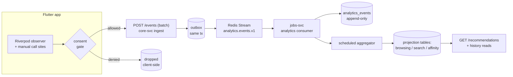
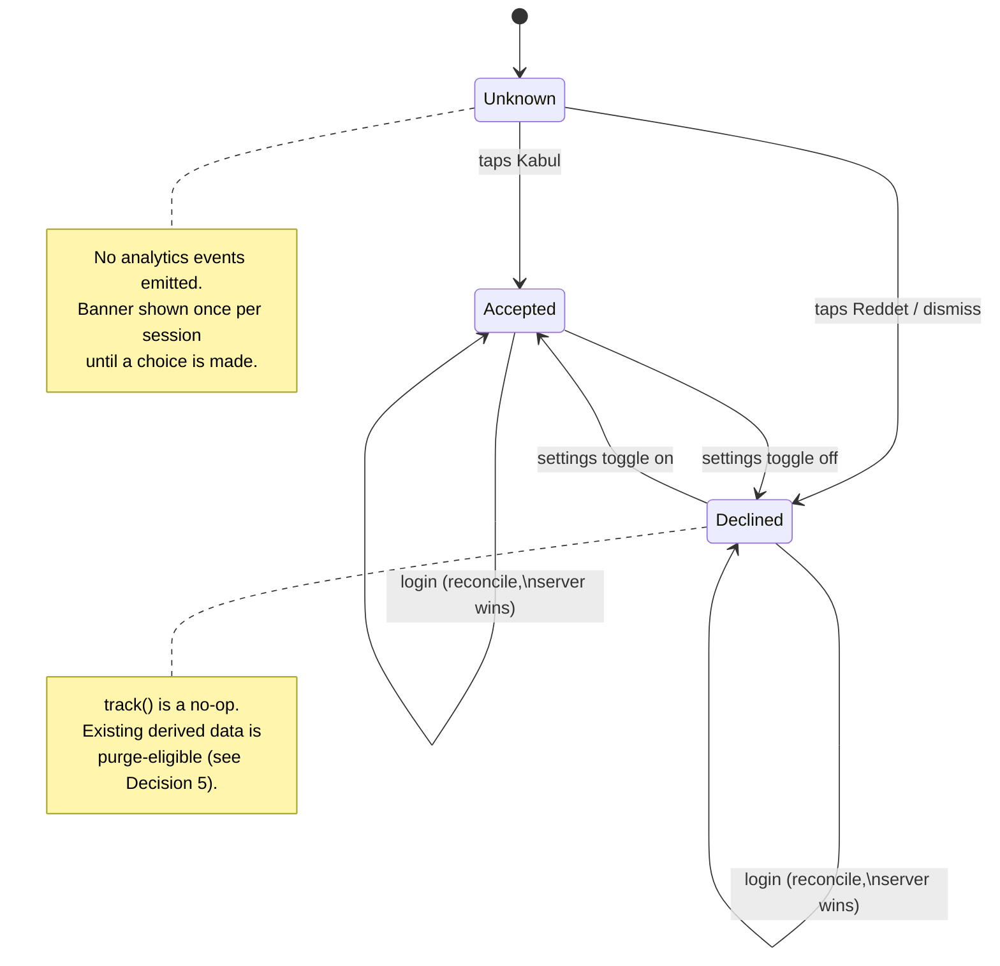

# Tranche 4 Design — Personalization + Analytics Foundation

> **Status:** design document (no production code). This is the input contract
> for the Tranche 4 implementation PRs (4a, 4b, …). It locks seven architectural
> decisions so the implementation PRs consume them instead of relitigating them
> mid-build. Wrong taxonomy → migration in six months; wrong consent model →
> regulatory exposure; wrong storage shape → recommendation-infra rewrite. One
> deliberate design PR is cheap insurance.

## Table of contents

1. [Current state](#1-current-state)
2. [Decision 1 — Event taxonomy](#2-decision-1--event-taxonomy)
3. [Decision 2 — Storage shape](#3-decision-2--storage-shape)
4. [Decision 3 — Consent model](#4-decision-3--consent-model)
5. [Decision 4 — Identity model](#5-decision-4--identity-model)
6. [Decision 5 — Retention policy](#6-decision-5--retention-policy)
7. [Decision 6 — Instrumentation pattern](#7-decision-6--instrumentation-pattern)
8. [Decision 7 — Bundle shape](#8-decision-7--bundle-shape)
9. [Implementation tranche split](#9-implementation-tranche-split)
10. [Open questions](#10-open-questions)
11. [Risk notes](#11-risk-notes)
12. [Glossary](#12-glossary)

---

## 1. Current state

Evidence-based baseline (read-only audit, 2026-05-31). Each row is what exists
*today* on `main` after Tranche 3 (#25) merged.

| Capability | Current state (evidence) |
|---|---|
| Flutter analytics SDK | **None** — no analytics/telemetry dependency in `mobile/pubspec.yaml` (no firebase/sentry/mixpanel/amplitude/posthog/segment). |
| Search history (client) | **Partial** — `RecentSearchesNotifier` (`mobile/lib/features/catalog/providers/recent_searches_provider.dart`): local `SharedPreferences` only, max 5, key `mopro_recent_searches`; never leaves the device. |
| Browsing / recently-viewed history | **Missing** — no `recentlyViewedProvider`; the home "Son baktıkların" rail is unbuilt (REPORT backlog, "hide-when-empty"). |
| Backend analytics events | **None** — `internal/eventbus/registry.go` carries *business* events only (`ecom.order.delivered.v1`, `ecom.payment.captured.v1`, `ecom.user.created.v1`, …). No `analytics_events` / `audit_log` / `event_log` table anywhere. |
| Event transport | **Redis Streams + outbox** — `internal/eventbus/redis_bus.go` + `internal/outbox` (transactional outbox → XADD). The established async path. |
| External event broker | **Absent** — `deploy/docker-compose.yml` runs postgres-ecom, postgres-ledger, pgbouncer ×2, redis, meilisearch, caddy, core/fin/jobs-svc, grafana-agent. No Kafka/Redpanda/NATS/Pulsar. |
| Recommendations API | **Stubbed** — `GET /recommendations` returns 501 (`internal/api/core_impl.go:74`); endpoint exists, no data behind it. |
| Aggregation host (cron) | **jobs-svc exists** (notification/support/media/sizefinder); fin-svc owns the cashback/payout crons. No analytics aggregator yet. |
| Object storage | **Referenced, not provisioned** — `internal/media/api.go` names Backblaze B2 (external), but no MinIO/S3 container in compose; not on the analytics critical path. |
| Guest→user merge precedent | **Present** — `mergeGuestCart` POSTs `/cart/merge` on login, then clears the local guest cart (`mobile/lib/features/cart/application/cart_merge_service.dart`); favorites follow the same shape. |
| Guest personalization hook | **Present** — `OptionalAuth` middleware (`internal/identity/middleware/auth.go:61`) exposes the user id to public reads when a token is present, else treats the caller as a guest. |
| Consent / cookie / tracking UX | **None for analytics** — only checkout *legal* checkboxes (`consent_sales`, `consent_distance_contract`) and a `privacy` label in the locale files. No tracking-consent surface. |
| Consent category system | **None** — the only preference system is the theme (light/dark); no precedent for toggle-by-category. |
| Regulatory posture | **Documented, not enforced** — `CLAUDE.md §6`: KVKK (TR launch) / GDPR (EU) / PDPL (UAE), deferred to jurisdiction; no consent gating in code today. |
| Denormalized-projection discipline | **Established** — `helpful_count`, `answer_count` refreshed in-tx (CONTRIBUTING "Storage-layer idempotency"); the precedent for derived analytics projection tables. |

**Reading of the baseline.** The async plumbing (Redis Streams + outbox) and the
derived-cache discipline already exist; an analytics pipeline is a *new consumer
of established patterns*, not new infrastructure. The two genuinely new surfaces
are (a) an analytics event store and (b) a tracking-consent UX — and the consent
surface is greenfield with real regulatory weight. The decisions below resolve
those tradeoffs before code lands.

---

## 2. Decision 1 — Event taxonomy

**Chosen: Standard (~20 events).**

**Rationale.** The product intent is a *real recommendation surface* (the
`GET /recommendations` stub is already on the roadmap to be backed), not just a
recently-viewed rail — but not a heatmap/ML lab either. Minimal (8) cannot
express category affinity or facet intent, so backing the recommender later would
force a taxonomy migration — exactly the six-month rewrite this PR exists to
avoid. Rich (40+) buys per-pixel fidelity nobody has asked for, at a privacy and
maintenance cost that is wrong for the current stage. Standard is the smallest
taxonomy that still carries the *intent* signals (filter/sort/category/variant +
binned dwell) a recommender needs, while keeping every field coarse enough to
stay defensible under KVKK/GDPR. It is the "decision the choice resolves":
recommendation-capable without becoming surveillance-grade.

**Concrete event list (the locked v1 taxonomy).** All names are
`snake_case`; payloads are small typed JSON. Binning (not raw values) is a
deliberate privacy choice carried into Decision 5.

| Event | Key payload fields | Notes |
|---|---|---|
| `page_view` | `route`, `referrer?` | Every navigated route (auto-emitted, Decision 6). |
| `product_view` | `product_id`, `variant_id?`, `source?` | PDP open; `source` = where the click came from. |
| `category_view` | `category_id` | Category/PLP landing. |
| `search` | `query_hash`, `result_count` | Query is **hashed**, not stored raw (privacy). |
| `filter_applied` | `facet`, `value` | PLP filter (size/color/price-bucket/brand). |
| `sort_changed` | `sort_key` | PLP/reviews/Q&A sort. |
| `mega_menu_opened` | `menu_id` | Desktop discovery signal. |
| `pdp_variant_selected` | `product_id`, `variant_id` | Variant intent. |
| `scroll_depth` | `route`, `bucket` (10/25/50/75/100) | Binned; one event per bucket crossed. |
| `time_on_page` | `route`, `bucket` (e.g. <5s/5-30s/30-120s/>120s) | Binned on page-leave. |
| `add_to_cart` | `variant_id`, `qty` | Business event (manual, Decision 6). |
| `remove_from_cart` | `variant_id`, `qty` | Business event. |
| `purchase` | `order_id`, `item_count`, `total_minor`, `currency` | Business event; amounts in minor units. |
| `login` | `method?` | Auth lifecycle. |
| `logout` | — | Auth lifecycle. |
| `session_start` | `session_id`, `platform` | Emitted on first event of a session. |
| `session_end` | `session_id`, `duration_bucket` | Emitted on session timeout/close. |

That is 17 named events; the `scroll_depth` buckets and a small reserve
(`favorite_added`, `favorite_removed`, `notification_opened`) bring it to the
~20 envelope. New events append to this table; **renames are migrations** and
must be justified in a follow-up ADR.

## 3. Decision 2 — Storage shape

**Chosen: Append-only log + derived projection tables.**

**Rationale.** This is the shape the codebase is already built for. The
denormalized-cache discipline (`helpful_count`, `answer_count` refreshed in-tx,
documented in CONTRIBUTING "Storage-layer idempotency") is the same idea applied
to analytics: an immutable source of truth plus cheap-to-read derived state.
Option A (log-only) ships a day sooner but makes every personalization read a
live scan/aggregate over an unbounded table — the `GET /recommendations` query
would get slower every week. Option C (external broker) is the right shape *only*
if real-time recommendations or BI tooling were imminent; they are not, and a
Kafka/Redpanda container does not fit the 6-vCPU / 24 GB single-VDS budget
(`CLAUDE.md §7` — "the headroom IS the design"). Standard volume at this stage is
comfortably served by Postgres + a scheduled aggregator on the existing jobs-svc.
The decision the choice resolves: **cheap, bounded-cost reads for every
personalization surface, without new infrastructure.**

**Schema sketch.** Lives in its own `analytics_schema` in `postgres-ecom`
(jobs-svc owns the aggregator; writes arrive via the existing outbox → Redis
Streams path so no module reaches across a boundary). Cross-schema JOINs stay
forbidden — projections store denormalized display fields, like `UserReview` does.

```sql
-- Source of truth: append-only, never UPDATE/DELETE except retention prune.
CREATE TABLE analytics_schema.analytics_events (
  id          BIGINT GENERATED ALWAYS AS IDENTITY PRIMARY KEY,
  event_id    UUID        NOT NULL UNIQUE,         -- producer-supplied, idempotent
  user_id     BIGINT,                              -- NULL for guests
  session_id  TEXT        NOT NULL,                -- guest+authed both carry one
  type        TEXT        NOT NULL,                -- one of the locked taxonomy
  payload     JSONB       NOT NULL DEFAULT '{}',
  market      TEXT        NOT NULL,
  occurred_at TIMESTAMPTZ NOT NULL,                -- client/event time
  created_at  TIMESTAMPTZ NOT NULL DEFAULT now()   -- ingest time (retention anchor)
);
CREATE INDEX ON analytics_schema.analytics_events (user_id, occurred_at DESC);
CREATE INDEX ON analytics_schema.analytics_events (session_id, occurred_at);
CREATE INDEX ON analytics_schema.analytics_events (type, created_at);

-- Derived projections (refreshed by the jobs-svc aggregator; cheap to read).
CREATE TABLE analytics_schema.user_browsing_history (
  user_id      BIGINT NOT NULL,
  product_id   BIGINT NOT NULL,
  last_viewed  TIMESTAMPTZ NOT NULL,
  view_count   INT NOT NULL DEFAULT 1,
  PRIMARY KEY (user_id, product_id)
);
CREATE TABLE analytics_schema.user_search_history (
  user_id      BIGINT NOT NULL,
  query_hash   TEXT NOT NULL,
  query_sample TEXT,                               -- last raw query, only if consent allows
  last_searched TIMESTAMPTZ NOT NULL,
  search_count INT NOT NULL DEFAULT 1,
  PRIMARY KEY (user_id, query_hash)
);
CREATE TABLE analytics_schema.user_category_affinity (
  user_id     BIGINT NOT NULL,
  category_id BIGINT NOT NULL,
  score       NUMERIC NOT NULL,                    -- decayed interaction weight
  updated_at  TIMESTAMPTZ NOT NULL,
  PRIMARY KEY (user_id, category_id)
);
```

**Event flow.**



The ingest endpoint writes to `analytics_events` and the outbox in one
transaction (the §4.5 outbox rule), so a consumer crash never loses events and
re-delivery is idempotent on `event_id`.

## 4. Decision 3 — Consent model

**Chosen: Binary opt-in.** Nothing in the analytics taxonomy fires until the user
accepts; a first-visit banner asks once, and a settings switch can flip the
choice later.

**Rationale.** The architecture is explicitly "global-ready" and names EU as a
future market (`CLAUDE.md §1`), so the safe regulatory default — the one that is
correct under *both* KVKK and GDPR — is opt-in, not opt-out. That eliminates the
two opt-out options regardless of launch geography: choosing opt-out now would
mean a consent-model migration (and a window of non-compliant data) the first
time an EU user is served. Between the two compliant options, **binary** is
chosen over **granular** because there is exactly *one* tracking purpose today:
analytics that powers personalization. Marketing sends are a separate, already
consent-gated system (notification preferences shipped in Tranche 2a), and
"Functional" (recently-viewed) is, in this design, a *consumer of the same
analytics pipeline* rather than an independent purpose — so granular categories
would be UX and code surface guarding distinctions that do not yet exist. The
consent record is modeled to **upgrade cleanly to granular later** (a category
enum with a single `analytics` member today; see Glossary) so adding `marketing`
analytics is an append, not a rewrite. The decision the choice resolves:
**compliant-everywhere from day one, with the least UX and code surface that
satisfies it.**

**UX implications.**
- A first-visit consent banner (adaptive: bottom sheet < 600, dialog ≥ 600 —
  reuse the `showAdaptiveModal` presenter from Tranche 3) with `Reddet` / `Kabul`
  and a one-line privacy summary linking to a policy page. New `consent.*` locale
  keys across tr/en/de/ar (none exist today — see §1).
- A persistent toggle in `/account` settings ("Veri ve gizlilik" / analytics
  on-off) so the choice is revocable, satisfying the KVKK/GDPR withdrawal right.
- Consent state is **stored server-side per user** (so it follows the account
  across devices) *and* mirrored to a local `SharedPreferences` flag (so a guest
  / pre-login session can be gated before any account exists). On login the local
  decision is reconciled with the server record (server wins if both exist).
- The client **hard-gates emission**: `analyticsService.track()` is a no-op when
  consent != accepted. The banner decision is itself an *essential* interaction
  and is never an analytics event.

**Consent state machine.**



Transitioning Accepted → Declined stops future emission immediately and flags the
user's already-derived projections for purge per Decision 5.

## 5. Decision 4 — Identity model

**Chosen: session-scoped guest tracking with merge-on-auth.** Guests who have
opted in (Decision 3) are tracked against a `session_id`; on login their session
is linked to the `user_id` and their projections are rebuilt to include the
pre-login activity.

**Rationale.** Pre-login browsing is a large, converting slice of an e-commerce
funnel; authed-only tracking would throw it away and leave the recommender blind
until after sign-in. The merge model is also the one the codebase already
endorses — `mergeGuestCart` reattributes guest cart state on login and clears the
local copy — so this is a *consistent* identity story, not a new concept. The
re-identification surface that makes regulators wary is real, but it is bounded
here by two facts: (a) nothing is tracked at all until the guest *explicitly
opts in* (Decision 3), so the merge only ever touches data the user already
consented to, and (b) the link is recorded in an auditable mapping rather than by
silently rewriting history. The decision the choice resolves: **full-funnel
attribution without orphaning guest data, while keeping the re-identification
step explicit and consent-gated.**

**Merge mechanics — append-only preserving.** Decision 2's `analytics_events` is
append-only; the merge therefore does **not** `UPDATE` event rows. Instead a tiny
mapping table records the identity link, and the aggregator resolves the
effective user at projection time:

```sql
CREATE TABLE analytics_schema.session_identity (
  session_id TEXT PRIMARY KEY,
  user_id    BIGINT NOT NULL,
  linked_at  TIMESTAMPTZ NOT NULL DEFAULT now()
);
-- Effective owner of any event:
--   COALESCE(e.user_id, si.user_id)
-- via LEFT JOIN session_identity si ON si.session_id = e.session_id
```

Flow on login (reuses the `/cart/merge` timing — same post-auth hook):
1. Client calls `POST /events/identify` with its current `session_id` (the
   server already knows `user_id` from the bearer token).
2. Handler `INSERT … ON CONFLICT (session_id) DO NOTHING` into `session_identity`
   (idempotent; a session links to exactly one user).
3. The handler enqueues a projection rebuild for that `user_id`; the aggregator
   folds the now-linked guest events into `user_browsing_history` /
   `user_search_history` / `user_category_affinity`.
4. The client rotates to a fresh `session_id` post-login is **not** required —
   the same session simply now carries a `user_id` on subsequent events.

A session links to **one** user (PK on `session_id`); a user may own many
sessions (many devices). This keeps the event log immutable, gives a clean audit
trail of when each link was made, and lets a Decision-5 purge sever the link
(delete the `session_identity` row) without rewriting events.

## 6. Decision 5 — Retention policy

_(pending decision)_

## 7. Decision 6 — Instrumentation pattern

_(pending decision)_

## 8. Decision 7 — Bundle shape

_(pending decision)_

## 9. Implementation tranche split

_(derived from Decision 7)_

## 10. Open questions

_(populated during synthesis)_

## 11. Risk notes

_(populated during synthesis)_

## 12. Glossary

_(populated during synthesis)_
