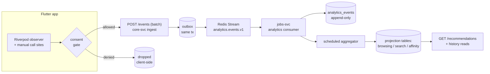
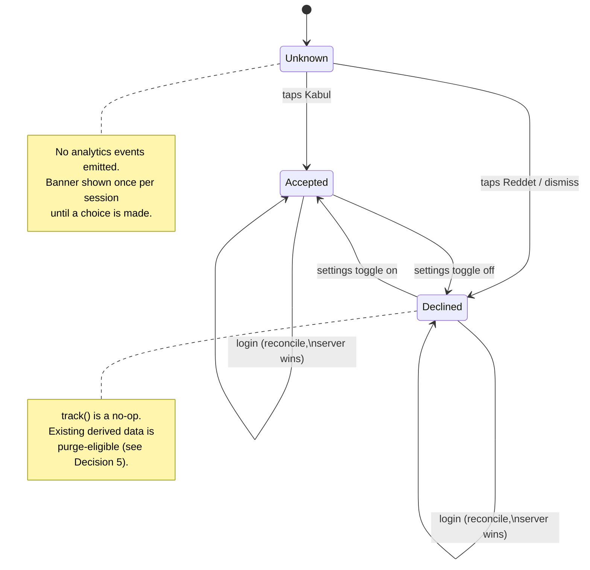

# Tranche 4 Design — Personalization + Analytics Foundation

> **Status:** design document (no production code). This is the input contract
> for the Tranche 4 implementation PRs (4a, 4b, …). It locks seven architectural
> decisions so the implementation PRs consume them instead of relitigating them
> mid-build. Wrong taxonomy → migration in six months; wrong consent model →
> regulatory exposure; wrong storage shape → recommendation-infra rewrite. One
> deliberate design PR is cheap insurance.

## Table of contents

1. [Current state](#1-current-state)
2. [Decision 1 — Event taxonomy](#2-decision-1--event-taxonomy)
3. [Decision 2 — Storage shape](#3-decision-2--storage-shape)
4. [Decision 3 — Consent model](#4-decision-3--consent-model)
5. [Decision 4 — Identity model](#5-decision-4--identity-model)
6. [Decision 5 — Retention policy](#6-decision-5--retention-policy)
7. [Decision 6 — Instrumentation pattern](#7-decision-6--instrumentation-pattern)
8. [Decision 7 — Bundle shape](#8-decision-7--bundle-shape)
9. [Implementation tranche split](#9-implementation-tranche-split)
10. [Open questions](#10-open-questions)
11. [Risk notes](#11-risk-notes)
12. [Glossary](#12-glossary)

---

## 1. Current state

Evidence-based baseline (read-only audit, 2026-05-31). Each row is what exists
*today* on `main` after Tranche 3 (#25) merged.

| Capability | Current state (evidence) |
|---|---|
| Flutter analytics SDK | **None** — no analytics/telemetry dependency in `mobile/pubspec.yaml` (no firebase/sentry/mixpanel/amplitude/posthog/segment). |
| Search history (client) | **Partial** — `RecentSearchesNotifier` (`mobile/lib/features/catalog/providers/recent_searches_provider.dart`): local `SharedPreferences` only, max 5, key `mopro_recent_searches`; never leaves the device. |
| Browsing / recently-viewed history | **Missing** — no `recentlyViewedProvider`; the home "Son baktıkların" rail is unbuilt (REPORT backlog, "hide-when-empty"). |
| Backend analytics events | **None** — `internal/eventbus/registry.go` carries *business* events only (`ecom.order.delivered.v1`, `ecom.payment.captured.v1`, `ecom.user.created.v1`, …). No `analytics_events` / `audit_log` / `event_log` table anywhere. |
| Event transport | **Redis Streams + outbox** — `internal/eventbus/redis_bus.go` + `internal/outbox` (transactional outbox → XADD). The established async path. |
| External event broker | **Absent** — `deploy/docker-compose.yml` runs postgres-ecom, postgres-ledger, pgbouncer ×2, redis, meilisearch, caddy, core/fin/jobs-svc, grafana-agent. No Kafka/Redpanda/NATS/Pulsar. |
| Recommendations API | **Stubbed** — `GET /recommendations` returns 501 (`internal/api/core_impl.go:74`); endpoint exists, no data behind it. |
| Aggregation host (cron) | **jobs-svc exists** (notification/support/media/sizefinder); fin-svc owns the cashback/payout crons. No analytics aggregator yet. |
| Object storage | **Referenced, not provisioned** — `internal/media/api.go` names Backblaze B2 (external), but no MinIO/S3 container in compose; not on the analytics critical path. |
| Guest→user merge precedent | **Present** — `mergeGuestCart` POSTs `/cart/merge` on login, then clears the local guest cart (`mobile/lib/features/cart/application/cart_merge_service.dart`); favorites follow the same shape. |
| Guest personalization hook | **Present** — `OptionalAuth` middleware (`internal/identity/middleware/auth.go:61`) exposes the user id to public reads when a token is present, else treats the caller as a guest. |
| Consent / cookie / tracking UX | **None for analytics** — only checkout *legal* checkboxes (`consent_sales`, `consent_distance_contract`) and a `privacy` label in the locale files. No tracking-consent surface. |
| Consent category system | **None** — the only preference system is the theme (light/dark); no precedent for toggle-by-category. |
| Regulatory posture | **Documented, not enforced** — `CLAUDE.md §6`: KVKK (TR launch) / GDPR (EU) / PDPL (UAE), deferred to jurisdiction; no consent gating in code today. |
| Denormalized-projection discipline | **Established** — `helpful_count`, `answer_count` refreshed in-tx (CONTRIBUTING "Storage-layer idempotency"); the precedent for derived analytics projection tables. |

**Reading of the baseline.** The async plumbing (Redis Streams + outbox) and the
derived-cache discipline already exist; an analytics pipeline is a *new consumer
of established patterns*, not new infrastructure. The two genuinely new surfaces
are (a) an analytics event store and (b) a tracking-consent UX — and the consent
surface is greenfield with real regulatory weight. The decisions below resolve
those tradeoffs before code lands.

---

## 2. Decision 1 — Event taxonomy

**Chosen: Standard (~20 events).**

**Rationale.** The product intent is a *real recommendation surface* (the
`GET /recommendations` stub is already on the roadmap to be backed), not just a
recently-viewed rail — but not a heatmap/ML lab either. Minimal (8) cannot
express category affinity or facet intent, so backing the recommender later would
force a taxonomy migration — exactly the six-month rewrite this PR exists to
avoid. Rich (40+) buys per-pixel fidelity nobody has asked for, at a privacy and
maintenance cost that is wrong for the current stage. Standard is the smallest
taxonomy that still carries the *intent* signals (filter/sort/category/variant +
binned dwell) a recommender needs, while keeping every field coarse enough to
stay defensible under KVKK/GDPR. It is the "decision the choice resolves":
recommendation-capable without becoming surveillance-grade.

**Concrete event list (the locked v1 taxonomy).** All names are
`snake_case`; payloads are small typed JSON. Binning (not raw values) is a
deliberate privacy choice carried into Decision 5.

| Event | Key payload fields | Notes |
|---|---|---|
| `page_view` | `route`, `referrer?` | Every navigated route (auto-emitted, Decision 6). |
| `product_view` | `product_id`, `variant_id?`, `source?` | PDP open; `source` = where the click came from. |
| `category_view` | `category_id` | Category/PLP landing. |
| `search` | `query_hash`, `result_count` | Query is **hashed**, not stored raw (privacy). |
| `filter_applied` | `facet`, `value` | PLP filter (size/color/price-bucket/brand). |
| `sort_changed` | `sort_key` | PLP/reviews/Q&A sort. |
| `mega_menu_opened` | `menu_id` | Desktop discovery signal. |
| `pdp_variant_selected` | `product_id`, `variant_id` | Variant intent. |
| `scroll_depth` | `route`, `bucket` (10/25/50/75/100) | Binned; one event per bucket crossed. |
| `time_on_page` | `route`, `bucket` (e.g. <5s/5-30s/30-120s/>120s) | Binned on page-leave. |
| `add_to_cart` | `variant_id`, `qty` | Business event (manual, Decision 6). |
| `remove_from_cart` | `variant_id`, `qty` | Business event. |
| `purchase` | `order_id`, `item_count`, `total_minor`, `currency` | Business event; amounts in minor units. |
| `login` | `method?` | Auth lifecycle. |
| `logout` | — | Auth lifecycle. |
| `session_start` | `session_id`, `platform` | Emitted on first event of a session. |
| `session_end` | `session_id`, `duration_bucket` | Emitted on session timeout/close. |

That is 17 named events; the `scroll_depth` buckets and a small reserve
(`favorite_added`, `favorite_removed`, `notification_opened`) bring it to the
~20 envelope. New events append to this table; **renames are migrations** and
must be justified in a follow-up ADR.

## 3. Decision 2 — Storage shape

**Chosen: Append-only log + derived projection tables.**

**Rationale.** This is the shape the codebase is already built for. The
denormalized-cache discipline (`helpful_count`, `answer_count` refreshed in-tx,
documented in CONTRIBUTING "Storage-layer idempotency") is the same idea applied
to analytics: an immutable source of truth plus cheap-to-read derived state.
Option A (log-only) ships a day sooner but makes every personalization read a
live scan/aggregate over an unbounded table — the `GET /recommendations` query
would get slower every week. Option C (external broker) is the right shape *only*
if real-time recommendations or BI tooling were imminent; they are not, and a
Kafka/Redpanda container does not fit the 6-vCPU / 24 GB single-VDS budget
(`CLAUDE.md §7` — "the headroom IS the design"). Standard volume at this stage is
comfortably served by Postgres + a scheduled aggregator on the existing jobs-svc.
The decision the choice resolves: **cheap, bounded-cost reads for every
personalization surface, without new infrastructure.**

**Schema sketch.** Lives in its own `analytics_schema` in `postgres-ecom`
(jobs-svc owns the aggregator; writes arrive via the existing outbox → Redis
Streams path so no module reaches across a boundary). Cross-schema JOINs stay
forbidden — projections store denormalized display fields, like `UserReview` does.

```sql
-- Source of truth: append-only, never UPDATE/DELETE except retention prune.
CREATE TABLE analytics_schema.analytics_events (
  id          BIGINT GENERATED ALWAYS AS IDENTITY PRIMARY KEY,
  event_id    UUID        NOT NULL UNIQUE,         -- producer-supplied, idempotent
  user_id     BIGINT,                              -- NULL for guests
  session_id  TEXT        NOT NULL,                -- guest+authed both carry one
  type        TEXT        NOT NULL,                -- one of the locked taxonomy
  payload     JSONB       NOT NULL DEFAULT '{}',
  market      TEXT        NOT NULL,
  occurred_at TIMESTAMPTZ NOT NULL,                -- client/event time
  created_at  TIMESTAMPTZ NOT NULL DEFAULT now()   -- ingest time (retention anchor)
);
CREATE INDEX ON analytics_schema.analytics_events (user_id, occurred_at DESC);
CREATE INDEX ON analytics_schema.analytics_events (session_id, occurred_at);
CREATE INDEX ON analytics_schema.analytics_events (type, created_at);

-- Derived projections (refreshed by the jobs-svc aggregator; cheap to read).
CREATE TABLE analytics_schema.user_browsing_history (
  user_id      BIGINT NOT NULL,
  product_id   BIGINT NOT NULL,
  last_viewed  TIMESTAMPTZ NOT NULL,
  view_count   INT NOT NULL DEFAULT 1,
  PRIMARY KEY (user_id, product_id)
);
CREATE TABLE analytics_schema.user_search_history (
  user_id      BIGINT NOT NULL,
  query_hash   TEXT NOT NULL,
  query_sample TEXT,                               -- last raw query, only if consent allows
  last_searched TIMESTAMPTZ NOT NULL,
  search_count INT NOT NULL DEFAULT 1,
  PRIMARY KEY (user_id, query_hash)
);
CREATE TABLE analytics_schema.user_category_affinity (
  user_id     BIGINT NOT NULL,
  category_id BIGINT NOT NULL,
  score       NUMERIC NOT NULL,                    -- decayed interaction weight
  updated_at  TIMESTAMPTZ NOT NULL,
  PRIMARY KEY (user_id, category_id)
);
```

**Event flow.**



The ingest endpoint writes to `analytics_events` and the outbox in one
transaction (the §4.5 outbox rule), so a consumer crash never loses events and
re-delivery is idempotent on `event_id`.

## 4. Decision 3 — Consent model

**Chosen: Binary opt-in.** Nothing in the analytics taxonomy fires until the user
accepts; a first-visit banner asks once, and a settings switch can flip the
choice later.

**Rationale.** The architecture is explicitly "global-ready" and names EU as a
future market (`CLAUDE.md §1`), so the safe regulatory default — the one that is
correct under *both* KVKK and GDPR — is opt-in, not opt-out. That eliminates the
two opt-out options regardless of launch geography: choosing opt-out now would
mean a consent-model migration (and a window of non-compliant data) the first
time an EU user is served. Between the two compliant options, **binary** is
chosen over **granular** because there is exactly *one* tracking purpose today:
analytics that powers personalization. Marketing sends are a separate, already
consent-gated system (notification preferences shipped in Tranche 2a), and
"Functional" (recently-viewed) is, in this design, a *consumer of the same
analytics pipeline* rather than an independent purpose — so granular categories
would be UX and code surface guarding distinctions that do not yet exist. The
consent record is modeled to **upgrade cleanly to granular later** (a category
enum with a single `analytics` member today; see Glossary) so adding `marketing`
analytics is an append, not a rewrite. The decision the choice resolves:
**compliant-everywhere from day one, with the least UX and code surface that
satisfies it.**

**UX implications.**
- A first-visit consent banner (adaptive: bottom sheet < 600, dialog ≥ 600 —
  reuse the `showAdaptiveModal` presenter from Tranche 3) with `Reddet` / `Kabul`
  and a one-line privacy summary linking to a policy page. New `consent.*` locale
  keys across tr/en/de/ar (none exist today — see §1).
- A persistent toggle in `/account` settings ("Veri ve gizlilik" / analytics
  on-off) so the choice is revocable, satisfying the KVKK/GDPR withdrawal right.
- Consent state is **stored server-side per user** (so it follows the account
  across devices) *and* mirrored to a local `SharedPreferences` flag (so a guest
  / pre-login session can be gated before any account exists). On login the local
  decision is reconciled with the server record (server wins if both exist).
- The client **hard-gates emission**: `analyticsService.track()` is a no-op when
  consent != accepted. The banner decision is itself an *essential* interaction
  and is never an analytics event.

**Consent state machine.**



Transitioning Accepted → Declined stops future emission immediately and flags the
user's already-derived projections for purge per Decision 5.

## 5. Decision 4 — Identity model

**Chosen: session-scoped guest tracking with merge-on-auth.** Guests who have
opted in (Decision 3) are tracked against a `session_id`; on login their session
is linked to the `user_id` and their projections are rebuilt to include the
pre-login activity.

**Rationale.** Pre-login browsing is a large, converting slice of an e-commerce
funnel; authed-only tracking would throw it away and leave the recommender blind
until after sign-in. The merge model is also the one the codebase already
endorses — `mergeGuestCart` reattributes guest cart state on login and clears the
local copy — so this is a *consistent* identity story, not a new concept. The
re-identification surface that makes regulators wary is real, but it is bounded
here by two facts: (a) nothing is tracked at all until the guest *explicitly
opts in* (Decision 3), so the merge only ever touches data the user already
consented to, and (b) the link is recorded in an auditable mapping rather than by
silently rewriting history. The decision the choice resolves: **full-funnel
attribution without orphaning guest data, while keeping the re-identification
step explicit and consent-gated.**

**Merge mechanics — append-only preserving.** Decision 2's `analytics_events` is
append-only; the merge therefore does **not** `UPDATE` event rows. Instead a tiny
mapping table records the identity link, and the aggregator resolves the
effective user at projection time:

```sql
CREATE TABLE analytics_schema.session_identity (
  session_id TEXT PRIMARY KEY,
  user_id    BIGINT NOT NULL,
  linked_at  TIMESTAMPTZ NOT NULL DEFAULT now()
);
-- Effective owner of any event:
--   COALESCE(e.user_id, si.user_id)
-- via LEFT JOIN session_identity si ON si.session_id = e.session_id
```

Flow on login (reuses the `/cart/merge` timing — same post-auth hook):
1. Client calls `POST /events/identify` with its current `session_id` (the
   server already knows `user_id` from the bearer token).
2. Handler `INSERT … ON CONFLICT (session_id) DO NOTHING` into `session_identity`
   (idempotent; a session links to exactly one user).
3. The handler enqueues a projection rebuild for that `user_id`; the aggregator
   folds the now-linked guest events into `user_browsing_history` /
   `user_search_history` / `user_category_affinity`.
4. The client rotates to a fresh `session_id` post-login is **not** required —
   the same session simply now carries a `user_id` on subsequent events.

A session links to **one** user (PK on `session_id`); a user may own many
sessions (many devices). This keeps the event log immutable, gives a clean audit
trail of when each link was made, and lets a Decision-5 purge sever the link
(delete the `session_identity` row) without rewriting events.

## 6. Decision 5 — Retention policy

**Chosen: raw bounded (90 days) + user-controllable derived.** Raw
`analytics_events` are pruned after 90 days; derived projections persist for
ongoing personalization but the user can delete their own history on demand, and
consent withdrawal purges it.

**Rationale.** This is the only option that closes the loop opened by Decisions 3
and 4. An opt-in regime under KVKK/GDPR carries a withdrawal right and a
Right-to-be-Forgotten obligation; "indefinite, no controls" directly contradicts
the consent posture, and "raw 90d, derived indefinite" leaves no deletion path
for the derived profile that is the *actually* sensitive artifact. Bounding raw
events at 90 days also keeps the append-only log's storage cost flat (it stops
being unbounded), while keeping derived projections lets personalization survive
the prune — the projections are the cheap-read product, the raw log is just the
rebuildable source. The decision the choice resolves: **a defensible
data-minimization story (bounded raw + on-demand erase) that satisfies the opt-in
regime without throwing away the personalization product.**

**Deletion mechanics.**
- **Scheduled prune (daily).** A `analytics-retention-cron` on jobs-svc deletes
  `analytics_events WHERE created_at < now() - interval '90 days'`. This is the
  *only* sanctioned bulk delete on the event log; it batches to avoid long locks.
  Derived projections are untouched (they are rebuilt forward, not from >90d raw).
- **User-initiated erase.** A "Geçmişimi sil" action in `/account` privacy
  settings calls `DELETE /me/analytics`, which in one transaction: deletes the
  user's `analytics_events`, their projection rows
  (`user_browsing_history`/`user_search_history`/`user_category_affinity`), and
  their `session_identity` links. Idempotent; returns 204.
- **Consent withdrawal (Decision 3, Accepted → Declined).** Triggers the same
  erase path automatically, so flipping the toggle off both stops emission and
  removes already-derived data — the withdrawal right in one action.
- **Account closure.** Hooks the existing account-deletion path: the analytics
  erase runs as part of it (documented as a prerequisite wire-up for 4a).
- **Granularity.** v1 erase is all-or-nothing per user (matches the binary
  consent grain). Per-category erase is a no-op extension if Decision 3 ever
  upgrades to granular.

Raw events older than 90 days cannot be used to rebuild a projection, so a
projection's lookback window is effectively ≤ 90 days for any field derived from
raw counts — an intentional bound, not a defect.

## 7. Decision 6 — Instrumentation pattern

**Chosen: hybrid.** Mechanical signals are auto-emitted by observers; semantic
business events are emitted by explicit `track()` call sites. All emission funnels
through one consent gate and one batching client.

**Rationale.** The taxonomy itself is split-natured: `page_view`, `session_*`,
`scroll_depth`, `time_on_page` are *mechanical* (derivable from navigation and
scroll state with zero business knowledge), while `add_to_cart`, `purchase`,
`pdp_variant_selected` carry *semantics and payload* (qty, order total, variant)
that are fragile to infer from state diffs. Pure manual would let the mechanical
events drift — every new screen is a chance to forget `page_view`. Pure
observer-driven would force `purchase`/`add_to_cart` to be reverse-engineered from
provider deltas, which is exactly where inference breaks. Hybrid puts each event
where it is cheapest and most reliable, and it matches the codebase's existing
observability posture (it already wraps middleware with `TraceAndLog`; an
analytics observer is the client-side analogue). The decision the choice
resolves: **complete, drift-resistant coverage for mechanical events plus exact,
enrichable payloads for business events — one pattern, two registration styles.**

**Concrete split.**

| Auto (observers) | Mechanism |
|---|---|
| `page_view` | a `NavigatorObserver` on go_router → emits on `didPush`/`didReplace` with the matched route. |
| `session_start` / `session_end` | app-lifecycle (`WidgetsBindingObserver`) + an idle timeout (e.g. 30 min) rotating `session_id`. |
| `scroll_depth` | a shared scroll-listener mixin on long screens (PLP/PDP/home) emitting once per bucket crossed. |
| `time_on_page` | computed on route-leave from the `page_view` timestamp, emitted binned. |

| Manual (`track()` call sites) | Where |
|---|---|
| `add_to_cart` / `remove_from_cart` | cart notifier mutation methods. |
| `purchase` | checkout-success handler (has `order_id`, totals). |
| `product_view` / `pdp_variant_selected` | PDP open + variant selector. |
| `search` | the search submit path (alongside `RecentSearchesNotifier.add`). |
| `filter_applied` / `sort_changed` | PLP filter/sort callbacks. |
| `category_view` / `mega_menu_opened` | category landing + mega-menu open. |

**Shared plumbing (both styles route through it).**
- A single `analyticsService.track(AnalyticsEvent)` API. Auto observers and manual
  call sites both call it; neither talks to the network directly.
- **Consent gate first.** `track()` returns immediately (no-op) unless consent ==
  Accepted (Decision 3). The gate is the one place emission is allowed or denied.
- **Client-side batching.** Events accumulate in an in-memory queue, flushed to
  `POST /events` on a size/time threshold (e.g. 20 events or 10 s) and on app
  background, to avoid a request per tap. Each event carries a client-generated
  `event_id` (UUID) for idempotent ingest (Decision 2).
- **A Riverpod provider** owns the service so it is overridable in tests with a
  fake (recording) sink — the same shape the flow tests already use for `dio`.

Manual call sites are few and live next to the business logic that already knows
the payload; the observers are written once and cover every screen automatically.

## 8. Decision 7 — Bundle shape

**Chosen: infrastructure + one concrete consumer in 4a.** Tranche 4a ships the
full pipeline (ingest, `analytics_events`, projections, consent banner/settings,
retention crons, merge) *plus one* visible surface: a **server-backed
"Son baktıkların" recently-viewed rail** driven by `product_view` →
`user_browsing_history`. Tranche 4b is an optional follow-up (recent-search
autocomplete and/or backing `GET /recommendations`).

**Rationale.** Infrastructure-only (Option A) is the tidiest split, but analytics
plumbing with *no consumer* is the one kind of code that can pass every test and
still be subtly wrong — projections shaped for queries nobody runs yet, payloads
missing a field the first consumer needs. Bundling exactly one consumer forces
the pipeline to prove itself end-to-end (event emitted → ingested → projected →
read back on a screen) before 4b builds on those assumptions, which is the
strongest guard against designing the projection wrong. Multiple consumers
(Option C) would re-introduce the partial-and-red risk the §1.6 escape hatch
exists to prevent. One consumer is also the *cheapest* end-to-end proof: the
recently-viewed rail is already a known backlog item ("Son baktıkların",
hide-when-empty), reuses the home-rail layout that exists, and exercises every
layer of the new stack with minimal new product surface. The decision the choice
resolves: **the infrastructure is validated by a real, shippable feature in 4a,
while scope stays single-domain and the §1.6 split remains available if 4a grows
mid-build.**

**§1.6 escape hatch (explicit).** If, during 4a implementation, the bundle hits a
scope wall (e.g. the consent UX or the merge mechanics balloon), the audit-data-
justified split is pre-authorized: carve the recently-viewed consumer out into
4b and ship 4a as infrastructure-only. The decision to split must be recorded the
same way Tranche 3 recorded *not* splitting — a one-paragraph note in that PR's
report citing the concrete wall.

The concrete PR breakdown is in [§9](#9-implementation-tranche-split).

## 9. Implementation tranche split

_(derived from Decision 7)_

## 10. Open questions

Each item names a suggested owner / gate. None blocks writing the 4a prompt; the
starred (★) ones should be resolved before 4a *merges*.

- **★ Privacy-policy page + consent copy review.** The opt-in banner needs final
  legal copy and a linked policy page. _Owner: product/legal before 4a merges._
- **★ Raw search-text storage (`query_sample`).** Confirm KVKK/GDPR stance on
  retaining raw query text even post-consent; default to hash-only if uncertain.
  _Owner: counsel; default-safe = drop `query_sample` until cleared._
- **★ Account-deletion wire-up.** Verify the existing account-deletion path and
  hook the analytics erase into it (Decision 5). _Owner: 4a audit-first step._
- **Stream isolation / backpressure.** Analytics is far higher-volume than the
  financial events sharing Redis Streams; 4a should use a **separate stream +
  consumer group** so analytics can never starve the cashback/payout consumers.
  _Owner: 4a infra design._
- **Session model details.** `session_id` generation and the idle-timeout value
  (assumed 30 min) are unspecified. _Owner: 4a; default 30 min unless product objects._
- **Observability.** Should ingest rate / queue depth / DLQ feed the existing
  Grafana Agent → Grafana Cloud? _Owner: 4a ops detail; recommend yes (cheap)._
- **Revisit-Decision-2 trigger.** If real-time recommendations or BI tooling
  become near-term, Option C (external broker) is the escape valve — but it
  breaks the single-VDS RAM budget, so it needs an infra ADR first. _Owner:
  Backlog; do not pre-build._
- **A/B testing.** Out of Tranche 4 scope; the event store is its prerequisite.
  _Owner: future tranche._

**Drive-by hygiene surfaced by the §1 audit (do NOT fix this PR):**
- Two REPORT backlog notes ("promo image errors silent — no telemetry"; "
  `trendingSearchesProvider` error invisible — telemetry should fire from the
  provider") are natural *first manual `track()` call sites* once the pipeline
  exists. _Owner: fold into 4a/4b, not a refactor now._
- Object storage is still unprovisioned (review/return photo backlog). Not on the
  analytics path, but noted so it isn't conflated with this tranche. _Owner:
  separate tranche._

## 11. Risk notes

Honest, not exhaustive.

- **Re-identification (merge).** Linking guest sessions to a user is a surface
  regulators scrutinize. Mitigated by: nothing tracked pre-consent (Decision 3),
  an auditable `session_identity` link rather than rewritten events (Decision 4),
  and on-demand erase (Decision 5). Counsel should still confirm the merge is
  disclosed in the privacy policy.
- **Low opt-in depresses data quality.** Binary opt-in (Decision 3) means a chunk
  of users never get tracked, so the recommender trains on a biased sample. This
  is the accepted cost of being compliant-everywhere; revisit copy/placement, not
  the model, if opt-in rates are low.
- **Search hashing vs. utility.** Hash-only queries (`query_hash`) lose
  typo/synonym analytics; `query_sample` would restore it but reintroduces raw-PII
  risk — kept consent-gated and flagged as an open question.
- **Single-VDS scaling ceiling.** A Postgres-resident event log on a 6-vCPU/24 GB
  box has a throughput ceiling. The 90-day prune (Decision 5) bounds storage, and
  Decision 2's Option C is the documented escape valve — but it is *not* pre-built,
  so a sudden volume spike is a known risk requiring an infra decision, not a
  config flip.
- **Client batching loss.** The in-memory flush queue (Decision 6) can lose its
  tail on a hard crash. Acceptable for analytics (not financial data); do not
  reuse this path for anything ledger-adjacent.
- **Taxonomy drift.** New events are appends; **renames are migrations**. Without
  discipline the taxonomy rots. Enforced by the locked table in §2 + an ADR
  requirement for any rename.
- **Consumer starvation.** If analytics shares the financial event stream it could
  back up the cashback/payout consumers — hence the separate-stream open question;
  treat it as a must-fix in 4a, not optional.

## 12. Glossary

**Events (the locked v1 taxonomy — §2):**
`page_view` (route navigated) · `product_view` (PDP opened) · `category_view`
(category/PLP landing) · `search` (query submitted; stored hashed) ·
`filter_applied` (PLP facet) · `sort_changed` (sort key) · `mega_menu_opened`
(desktop mega-menu) · `pdp_variant_selected` (variant chosen) · `scroll_depth`
(binned 10/25/50/75/100%) · `time_on_page` (binned on leave) · `add_to_cart` ·
`remove_from_cart` · `purchase` (order completed) · `login` · `logout` ·
`session_start` · `session_end`. Reserve: `favorite_added`, `favorite_removed`,
`notification_opened`.

**Consent categories** (Decision 3 ships only the first active member; the enum
exists so granular is a later append):
- **Essential** — service operation; never an analytics event, never gated.
- **Analytics** — the event pipeline in this design. The single gate v1 toggles.
- **Functional** — preference/personalization surfaces; treated as a *consumer*
  of Analytics in v1, not a separate gate.
- **Marketing** — reserved; marketing sends are already gated by notification
  preferences (Tranche 2a).

**Infrastructure components:**
- **`analytics_events`** — append-only source-of-truth table (`analytics_schema`).
- **Projection tables** — `user_browsing_history`, `user_search_history`,
  `user_category_affinity`; derived, cheap-read, rebuilt by the aggregator.
- **`session_identity`** — guest-session → user link table enabling merge-on-auth
  without mutating events (Decision 4).
- **Analytics consumer** — jobs-svc reader of the `analytics.events.v1` Redis
  Stream that appends to `analytics_events`.
- **Aggregator** — scheduled jobs-svc job that folds raw events into projections.
- **Retention cron** — daily jobs-svc job pruning raw events > 90 days (Decision 5).
- **`analyticsService` / consent gate** — client API all emission routes through;
  no-ops unless consent == Accepted; batches to `POST /events`.
- **`/events`, `/events/identify`, `/me/analytics`** — ingest (batch), session
  identity link (merge), and user erase (RTBF) endpoints.
